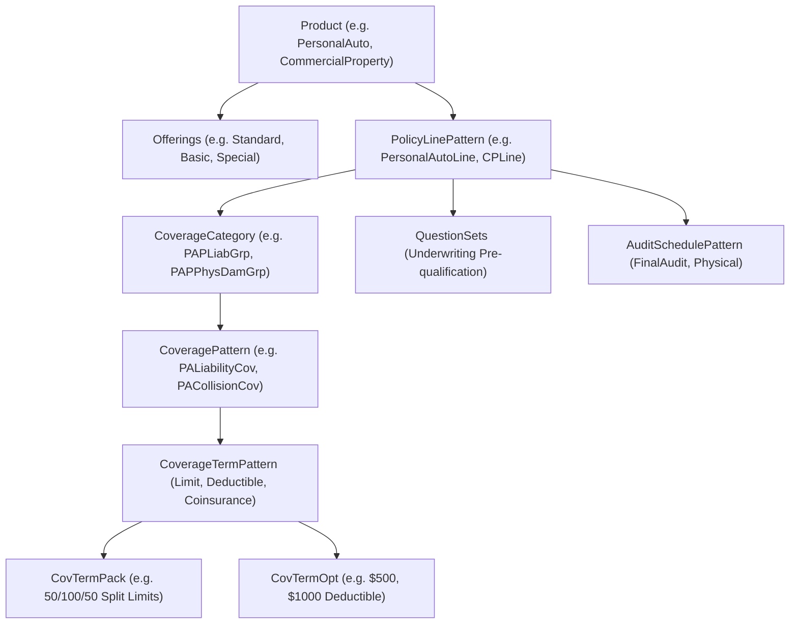

# PolicyCenter Product Model Specification

**Guidewire PolicyCenter Version:** 10.2.1.1711 (Platform 10.201.1)
**Product Model Directory:** `C:\GW10\PolicyCenter\modules\configuration\config\resources\productmodel`
**Extraction Date:** 2026-09-26

---

## 1. Product Model Architecture & Hierarchy

In Guidewire PolicyCenter 10, the product model is a modular, metadata-driven architecture defining the insurance offerings, coverages, limits, deductibles, and underwriting rules. Based strictly on the installed source files in `modules\configuration\config\resources\productmodel`, the object hierarchy is structured as follows:

### Hierarchy Explanation (Verified from Source)
1. **Product (`Product.xml`)**: Top-level marketable policy pattern. Defines policy number sequencing (`policyNumberPattern`), product line associations (`ProductPolicyLinePattern`), and product-level offerings.
2. **Offering (`offerings/*.xml`)**: Packaging variant of a product (e.g., standard coverage tiers vs. high-deductible tiers) that filters available coverage patterns and limits.
3. **PolicyLinePattern (`PolicyLine.xml`)**: The line of business specification. Instantiates the effective-dated `PolicyLine` entity subtype (e.g. `PersonalAutoLine`).
4. **CoveragePattern (`coveragepatterns/*.xml`)**: The insurance coverage definition. Specifies `owningEntityType` (e.g. `PersonalVehicle` or `PersonalAutoLine`), `coverageCategory`, `coverageSubtype`, and `existence` (`Required`, `Suggested`, `Electable`).
5. **CovTerms (`CovTerms` container)**: Configurable clauses within a coverage pattern, divided into four concrete pattern types:
   - `PackageCovTermPattern`: Bundled package limits (e.g. 100/300/100 split liability limits).
   - `OptionCovTermPattern`: Discrete selectable options (e.g. Deductibles: $250, $500, $1,000, $2,500).
   - `DirectCovTermPattern`: Numeric / monetary user-entered values (e.g. Stated Amount, Replacement Cost).
   - `TypekeyCovTermPattern`: Values chosen from a Guidewire Typelist.
6. **QuestionSets (`questionsets/*.xml`)**: Underwriting eligibility questions grouped into sets and answered on the PolicyPeriod, PolicyLine, or PolicyLocation.

---

## 2. Installed Products Catalog

| Product Code | Display Name | Associated Policy Lines | Offerings | Source Path |
|--------------|--------------|-------------------------|-----------|-------------|
| BusinessAuto | BusinessAuto | BusinessAutoLine | , BASpecialRisk, , BAStandardOffering | `C:\GW10\PolicyCenter\modules\configuration\config\resources\productmodel\products\BusinessAuto\BusinessAuto.xml` |
| BusinessOwners | BusinessOwners | BOPLine | , BOPBronze, , BOPGold, , BOPPartners, , BOPPlatinum, , BOPSilver | `C:\GW10\PolicyCenter\modules\configuration\config\resources\productmodel\products\BusinessOwners\BusinessOwners.xml` |
| CommercialPackage | CommercialPackage | CPLine, GLLine, IMLine | , CPPPremium, , CPPSpecialRisk, , CPPStandard | `C:\GW10\PolicyCenter\modules\configuration\config\resources\productmodel\products\CommercialPackage\CommercialPackage.xml` |
| CommercialProperty | CommercialProperty | CPLine | None (Default) | `C:\GW10\PolicyCenter\modules\configuration\config\resources\productmodel\products\CommercialProperty\CommercialProperty.xml` |
| GeneralLiability | GeneralLiability | GLLine | , GLSpclRisk, , GLStandard | `C:\GW10\PolicyCenter\modules\configuration\config\resources\productmodel\products\GeneralLiability\GeneralLiability.xml` |
| HOPHomeowners | HOPHomeowners | HOPLine | None (Default) | `C:\GW10\PolicyCenter\modules\configuration\config\resources\productmodel\products\HOPHomeowners\HOPHomeowners.xml` |
| InlandMarine | InlandMarine | IMLine | None (Default) | `C:\GW10\PolicyCenter\modules\configuration\config\resources\productmodel\products\InlandMarine\InlandMarine.xml` |
| Manual | Manual | ManualLine | None (Default) | `C:\GW10\PolicyCenter\modules\configuration\config\resources\productmodel\products\Manual\Manual.xml` |
| PersonalAuto | PersonalAuto | PersonalAutoLine | , PABasic, , PAPremium, , StandardProgram | `C:\GW10\PolicyCenter\modules\configuration\config\resources\productmodel\products\PersonalAuto\PersonalAuto.xml` |
| WC7WorkersComp | WC7WorkersComp | WC7Line | None (Default) | `C:\GW10\PolicyCenter\modules\configuration\config\resources\productmodel\products\WC7WorkersComp\WC7WorkersComp.xml` |
| WorkersComp | WorkersComp | WorkersCompLine | None (Default) | `C:\GW10\PolicyCenter\modules\configuration\config\resources\productmodel\products\WorkersComp\WorkersComp.xml` |

---

## 3. Policy Lines & Coverage Patterns

### Policy Line: BOPLine

**Source:** `C:\GW10\PolicyCenter\modules\configuration\config\resources\productmodel\policylinepatterns\BOPLine\BOPLine.xml`
**Owning Entity Subtype:** `BusinessOwnersLine`
**Description:** Policy line pattern
**Total Discovered Coverage Patterns:** 84

| Coverage Code | Category | Existence | Owning Entity | Coverage Terms | Source Path |
|---------------|----------|-----------|---------------|----------------|-------------|
| BOPAdditionalCov | BOPLiabilityCat | Suggested | BusinessOwnersLine | SBSpecialPacks (TypekeyCovTermPattern) | `C:\GW10\PolicyCenter\modules\configuration\config\resources\productmodel\policylinepatterns\BOPLine\coveragepatterns\BOPAdditionalCov.xml` |
| BOPAggLimitProjCov | BOPContractorCat | Electable | BusinessOwnersLine | None | `C:\GW10\PolicyCenter\modules\configuration\config\resources\productmodel\policylinepatterns\BOPLine\coveragepatterns\BOPAggLimitProjCov.xml` |
| BOPAlaskaAFGLCov | BOPStateCat | Suggested | BusinessOwnersLine | BOPAlaskaAFGLLim (DirectCovTermPattern) | `C:\GW10\PolicyCenter\modules\configuration\config\resources\productmodel\policylinepatterns\BOPLine\coveragepatterns\BOPAlaskaAFGLCov.xml` |
| BOPBarberCov | BOPProfessionalCat | Electable | BusinessOwnersLine | BOPBarberBeautNum (DirectCovTermPattern) | `C:\GW10\PolicyCenter\modules\configuration\config\resources\productmodel\policylinepatterns\BOPLine\coveragepatterns\BOPBarberCov.xml` |
| BOPBuildingCov | BOPBuildingCat | Suggested | BOPBuilding | BOPBldgLim (DirectCovTermPattern); BOPBldgValuation (TypekeyCovTermPattern); BOPBuildingCoin (OptionCovTermPattern); BOPBldgAnnualIncrease (OptionCovTermPattern) | `C:\GW10\PolicyCenter\modules\configuration\config\resources\productmodel\policylinepatterns\BOPLine\coveragepatterns\BOPBuildingCov.xml` |
| BOPBurgRobCov | BOPCrimeCat | Electable | BOPLocation | BOPBurgRobLim (DirectCovTermPattern) | `C:\GW10\PolicyCenter\modules\configuration\config\resources\productmodel\policylinepatterns\BOPLine\coveragepatterns\BOPBurgRobCov.xml` |
| BOPBusIncDepPrpCov | BOPIncomeExpenseCat | Electable | BOPBuilding | BOPBIDepPropLim (DirectCovTermPattern) | `C:\GW10\PolicyCenter\modules\configuration\config\resources\productmodel\policylinepatterns\BOPLine\coveragepatterns\BOPBusIncDepPrpCov.xml` |
| BOPBusIncExtCov | BOPIncomeExpenseCat | Electable | BOPBuilding | BusIncomeExtended (OptionCovTermPattern) | `C:\GW10\PolicyCenter\modules\configuration\config\resources\productmodel\policylinepatterns\BOPLine\coveragepatterns\BOPBusIncExtCov.xml` |
| BOPBusIncPayrollCov | BOPIncomeExpenseCat | Electable | BOPBuilding | BusIncomeOrdPayroll (OptionCovTermPattern) | `C:\GW10\PolicyCenter\modules\configuration\config\resources\productmodel\policylinepatterns\BOPLine\coveragepatterns\BOPBusIncPayrollCov.xml` |
| BOPCAEqBldgRecCov | BOPStateCat | Electable | BOPBuilding | BOPCAEqBldgRecLimit (DirectCovTermPattern) | `C:\GW10\PolicyCenter\modules\configuration\config\resources\productmodel\policylinepatterns\BOPLine\coveragepatterns\BOPCAEqBldgRecCov.xml` |
| BOPCAEqBldgSubCov | BOPStateCat | Electable | BOPBuilding | BOPCAEqBldgSubDed (OptionCovTermPattern); BOPCAEqBldgSubLim (DirectCovTermPattern) | `C:\GW10\PolicyCenter\modules\configuration\config\resources\productmodel\policylinepatterns\BOPLine\coveragepatterns\BOPCAEqBldgSubCov.xml` |
| BOPCertTerrorCap | BOPTerrorismCat | Electable | BusinessOwnersLine | BOPCertTerrorCapLimit (DirectCovTermPattern) | `C:\GW10\PolicyCenter\modules\configuration\config\resources\productmodel\policylinepatterns\BOPLine\coveragepatterns\BOPCertTerrorCap.xml` |
| BOPCertTerrorismExcl | BOPTerrorismCat | Electable | BusinessOwnersLine | None | `C:\GW10\PolicyCenter\modules\configuration\config\resources\productmodel\policylinepatterns\BOPLine\coveragepatterns\BOPCertTerrorismExcl.xml` |
| BOPCert_BioChemExcl | BOPTerrorismCat | Electable | BusinessOwnersLine | None | `C:\GW10\PolicyCenter\modules\configuration\config\resources\productmodel\policylinepatterns\BOPLine\coveragepatterns\BOPCert_BioChemExcl.xml` |
| BOPComputerFraudCov | BOPCrimeCat | Electable | BusinessOwnersLine | BOPComputerFraudLim (OptionCovTermPattern) | `C:\GW10\PolicyCenter\modules\configuration\config\resources\productmodel\policylinepatterns\BOPLine\coveragepatterns\BOPComputerFraudCov.xml` |
| BOPCondoAssnCov | BOPProgramCat | Electable | BusinessOwnersLine | None | `C:\GW10\PolicyCenter\modules\configuration\config\resources\productmodel\policylinepatterns\BOPLine\coveragepatterns\BOPCondoAssnCov.xml` |
| BOPCondoUnitOwnCov | BOPBuildingOtherCat | Electable | BOPBuilding | CondoMiscProp (GenericCovTermPattern); CondoLossAssessment (GenericCovTermPattern); CondoOwnerLimit (DirectCovTermPattern); CondoMiscPropDed (OptionCovTermPattern) | `C:\GW10\PolicyCenter\modules\configuration\config\resources\productmodel\policylinepatterns\BOPLine\coveragepatterns\BOPCondoUnitOwnCov.xml` |
| BOPDesigPremProj | BOPContractorCat | Electable | BusinessOwnersLine | None | `C:\GW10\PolicyCenter\modules\configuration\config\resources\productmodel\policylinepatterns\BOPLine\coveragepatterns\BOPDesigPremProj.xml` |
| BOPElectricalSchedCov | BOPBuildingOtherCat | Electable | BOPBuilding | BOPElectricalSchedLimit (DirectCovTermPattern) | `C:\GW10\PolicyCenter\modules\configuration\config\resources\productmodel\policylinepatterns\BOPLine\coveragepatterns\BOPElectricalSchedCov.xml` |
| BOPEmpBenefits | BOPLiabilityOtherCat | Electable | BusinessOwnersLine | BOPEmpBenAggLim (DirectCovTermPattern); BOPEmpBenEachEmpDed (OptionCovTermPattern); BOPEmpBenEachEmpLim (DirectCovTermPattern); BOPEmpBenRetroDate (GenericCovTermPattern) | `C:\GW10\PolicyCenter\modules\configuration\config\resources\productmodel\policylinepatterns\BOPLine\coveragepatterns\BOPEmpBenefits.xml` |
| BOPEmpBenExtRpting | BOPLiabilityOtherCat | Electable | BusinessOwnersLine | None | `C:\GW10\PolicyCenter\modules\configuration\config\resources\productmodel\policylinepatterns\BOPLine\coveragepatterns\BOPEmpBenExtRpting.xml` |
| BOPEmpDisCov | BOPOtherIncludedCat | Electable | BusinessOwnersLine | BOPEmpDisLimit (OptionCovTermPattern); BOPEmpDisNumEmp (DirectCovTermPattern); BOPEmpDisNumLoc (DirectCovTermPattern) | `C:\GW10\PolicyCenter\modules\configuration\config\resources\productmodel\policylinepatterns\BOPLine\coveragepatterns\BOPEmpDisCov.xml` |
| BOPEqBldgCov | BOPBuildingSpecialPerilCat | Electable | BOPBuilding | EQDeductible (OptionCovTermPattern) | `C:\GW10\PolicyCenter\modules\configuration\config\resources\productmodel\policylinepatterns\BOPLine\coveragepatterns\BOPEqBldgCov.xml` |
| BOPEqSpBldgCov | BOPBuildingSpecialPerilCat | Electable | BOPBuilding | None | `C:\GW10\PolicyCenter\modules\configuration\config\resources\productmodel\policylinepatterns\BOPLine\coveragepatterns\BOPEqSpBldgCov.xml` |
| BOPFDService | BOPPolicyOtherCat | Electable | BusinessOwnersLine | None | `C:\GW10\PolicyCenter\modules\configuration\config\resources\productmodel\policylinepatterns\BOPLine\coveragepatterns\BOPFDService.xml` |
| BOPFoodContamCov | BOPPolicyOtherCat | Electable | BusinessOwnersLine | BOPFoodContamAdvLim (DirectCovTermPattern); BOPFoodContamLim (DirectCovTermPattern) | `C:\GW10\PolicyCenter\modules\configuration\config\resources\productmodel\policylinepatterns\BOPLine\coveragepatterns\BOPFoodContamCov.xml` |
| BOPForgeAltCov | BOPCrimeCat | Electable | BusinessOwnersLine | BOPForgeAltLimit (OptionCovTermPattern) | `C:\GW10\PolicyCenter\modules\configuration\config\resources\productmodel\policylinepatterns\BOPLine\coveragepatterns\BOPForgeAltCov.xml` |
| BOPFuncPerPropCov | BOPBuildingOtherCat | Electable | BOPBuilding | BOPFuncPerPropLim (DirectCovTermPattern) | `C:\GW10\PolicyCenter\modules\configuration\config\resources\productmodel\policylinepatterns\BOPLine\coveragepatterns\BOPFuncPerPropCov.xml` |
| BOPFuneralDirCov | BOPProfessionalCat | Electable | BusinessOwnersLine | BOPFuneralDirNum (DirectCovTermPattern) | `C:\GW10\PolicyCenter\modules\configuration\config\resources\productmodel\policylinepatterns\BOPLine\coveragepatterns\BOPFuneralDirCov.xml` |
| BOPFungiPropCov | BOPPolicyOtherCat | Electable | BusinessOwnersLine | BOPFungiPropLim (DirectCovTermPattern); BOPFungiAggLevel (TypekeyCovTermPattern); BOPFungiTimeCov (OptionCovTermPattern) | `C:\GW10\PolicyCenter\modules\configuration\config\resources\productmodel\policylinepatterns\BOPLine\coveragepatterns\BOPFungiPropCov.xml` |
| BOPGuestPropCov | BOPGuestCovCat | Electable | BusinessOwnersLine | GuestPropClaimLim (OptionCovTermPattern); GuestPropOccLim (OptionCovTermPattern) | `C:\GW10\PolicyCenter\modules\configuration\config\resources\productmodel\policylinepatterns\BOPLine\coveragepatterns\BOPGuestPropCov.xml` |
| BOPGuestSafeDepCov | BOPGuestCovCat | Electable | BusinessOwnersLine | BOPGuestSafeDepLimit (OptionCovTermPattern) | `C:\GW10\PolicyCenter\modules\configuration\config\resources\productmodel\policylinepatterns\BOPLine\coveragepatterns\BOPGuestSafeDepCov.xml` |
| BOPHearingAidCov | BOPProfessionalCat | Electable | BusinessOwnersLine | BOPHearingAidSales (DirectCovTermPattern) | `C:\GW10\PolicyCenter\modules\configuration\config\resources\productmodel\policylinepatterns\BOPLine\coveragepatterns\BOPHearingAidCov.xml` |
| BOPHiredAuto | BOPOtherIncludedCat | Electable | BusinessOwnersLine | None | `C:\GW10\PolicyCenter\modules\configuration\config\resources\productmodel\policylinepatterns\BOPLine\coveragepatterns\BOPHiredAuto.xml` |
| BOPLeasedWorkerInjCov | BOPLiabilityOtherCat | Electable | BusinessOwnersLine | None | `C:\GW10\PolicyCenter\modules\configuration\config\resources\productmodel\policylinepatterns\BOPLine\coveragepatterns\BOPLeasedWorkerInjCov.xml` |
| BOPLiabilityCov | BOPLiabilityCat | Required | BusinessOwnersLine | BOPLiability (PackageCovTermPattern); BOPLiabPDDeductible (OptionCovTermPattern); BOPLiabDeductType (TypekeyCovTermPattern) | `C:\GW10\PolicyCenter\modules\configuration\config\resources\productmodel\policylinepatterns\BOPLine\coveragepatterns\BOPLiabilityCov.xml` |
| BOPLiquorCov | BOPLiquorCat | Electable | BusinessOwnersLine | BOPLiquorAggLim (DirectCovTermPattern); BOPLiquorCauseBILim (DirectCovTermPattern); BOPLiquorCauseLim (DirectCovTermPattern); BOPLiquorCauseMSLim (DirectCovTermPattern); BOPLiquorMSLim (DirectCovTermPattern); BOPLiquorPersonBILim (DirectCovTermPattern); BOPLiquorPersonLim (DirectCovTermPattern); BOPLiquorPersonMSLim (DirectCovTermPattern); BOPLiquorPersonPDLim (DirectCovTermPattern) | `C:\GW10\PolicyCenter\modules\configuration\config\resources\productmodel\policylinepatterns\BOPLine\coveragepatterns\BOPLiquorCov.xml` |
| BOPLiquorEvents | BOPLiquorCat | Electable | BusinessOwnersLine | LiqLiabEventsDescription (GenericCovTermPattern); LiqLiabEventDate (GenericCovTermPattern) | `C:\GW10\PolicyCenter\modules\configuration\config\resources\productmodel\policylinepatterns\BOPLine\coveragepatterns\BOPLiquorEvents.xml` |
| BOPLiquorRemoveExc | BOPLiquorCat | Electable | BusinessOwnersLine | None | `C:\GW10\PolicyCenter\modules\configuration\config\resources\productmodel\policylinepatterns\BOPLine\coveragepatterns\BOPLiquorRemoveExc.xml` |
| BOPLocWindHailCov | BOPLocationCat | Electable | BOPLocation | BOPWindHailDed (OptionCovTermPattern); BOPWindHailMoneyDed (OptionCovTermPattern) | `C:\GW10\PolicyCenter\modules\configuration\config\resources\productmodel\policylinepatterns\BOPLine\coveragepatterns\BOPLocWindHailCov.xml` |
| BOPMALeadPoisonCov | BOPStateCat | Electable | BOPBuilding | None | `C:\GW10\PolicyCenter\modules\configuration\config\resources\productmodel\policylinepatterns\BOPLine\coveragepatterns\BOPMALeadPoisonCov.xml` |
| BOPMATenantReloCov | BOPStateCat | Required | BOPBuilding | None | `C:\GW10\PolicyCenter\modules\configuration\config\resources\productmodel\policylinepatterns\BOPLine\coveragepatterns\BOPMATenantReloCov.xml` |
| BOPMechBreakdownCov | BOPBuildingUtilitiesCat | Electable | BOPBuilding | BOPMechBreakdownLim (DirectCovTermPattern); BOPMechBreakdownDeduct (DirectCovTermPattern); BOPMechBreakdownIncomeDeduct (OptionCovTermPattern) | `C:\GW10\PolicyCenter\modules\configuration\config\resources\productmodel\policylinepatterns\BOPLine\coveragepatterns\BOPMechBreakdownCov.xml` |
| BOPMedExpCov | BOPLiabilityCat | Suggested | BusinessOwnersLine | BOPMedExpenseLimit (OptionCovTermPattern) | `C:\GW10\PolicyCenter\modules\configuration\config\resources\productmodel\policylinepatterns\BOPLine\coveragepatterns\BOPMedExpCov.xml` |
| BOPMineSubCov | BOPBuildingSpecialPerilCat | Electable | BOPBuilding | BOPMineSubLim (DirectCovTermPattern) | `C:\GW10\PolicyCenter\modules\configuration\config\resources\productmodel\policylinepatterns\BOPLine\coveragepatterns\BOPMineSubCov.xml` |
| BOPMoneySecCov | BOPCrimeCat | Electable | BOPLocation | BOPMoneyOnPremLim (DirectCovTermPattern); BOPMoneyOffPremLim (OptionCovTermPattern) | `C:\GW10\PolicyCenter\modules\configuration\config\resources\productmodel\policylinepatterns\BOPLine\coveragepatterns\BOPMoneySecCov.xml` |
| BOPMotelCov | BOPProgramCat | Required | BusinessOwnersLine | None | `C:\GW10\PolicyCenter\modules\configuration\config\resources\productmodel\policylinepatterns\BOPLine\coveragepatterns\BOPMotelCov.xml` |
| BOPNewAcquiredOrgCov | BOPPolicyOtherCat | Electable | BusinessOwnersLine | None | `C:\GW10\PolicyCenter\modules\configuration\config\resources\productmodel\policylinepatterns\BOPLine\coveragepatterns\BOPNewAcquiredOrgCov.xml` |
| BOPNonOwnedAutoCov | BOPOtherIncludedCat | Electable | BusinessOwnersLine | None | `C:\GW10\PolicyCenter\modules\configuration\config\resources\productmodel\policylinepatterns\BOPLine\coveragepatterns\BOPNonOwnedAutoCov.xml` |
| BOPOrdinanceCov | BOPBuildingCat | Electable | BOPBuilding | BOPOrdLawCov23Lim (DirectCovTermPattern); BOPOrdLawCov2Lim (DirectCovTermPattern); BOPOrdLawCov3Lim (DirectCovTermPattern); BOPOrdLawIncomeExpense (GenericCovTermPattern); BOPOrdLawIncomeExpenseDeduct (OptionCovTermPattern); BOPOrdLawCov1yesno (GenericCovTermPattern) | `C:\GW10\PolicyCenter\modules\configuration\config\resources\productmodel\policylinepatterns\BOPLine\coveragepatterns\BOPOrdinanceCov.xml` |
| BOPOutdoorProp | BOPLocationCat | Electable | BOPLocation | BOPOutdoorPropLim (PackageCovTermPattern) | `C:\GW10\PolicyCenter\modules\configuration\config\resources\productmodel\policylinepatterns\BOPLine\coveragepatterns\BOPOutdoorProp.xml` |
| BOPOutSignCov | BOPLocationCat | Electable | BOPLocation | BOPOutdoorSignLim (DirectCovTermPattern) | `C:\GW10\PolicyCenter\modules\configuration\config\resources\productmodel\policylinepatterns\BOPLine\coveragepatterns\BOPOutSignCov.xml` |
| BOPOverflowCov | BOPLocationCat | Electable | BOPLocation | BOPOverflowLim (DirectCovTermPattern) | `C:\GW10\PolicyCenter\modules\configuration\config\resources\productmodel\policylinepatterns\BOPLine\coveragepatterns\BOPOverflowCov.xml` |
| BOPPersAdvertInj | BOPLiabilityCat | Suggested | BusinessOwnersLine | None | `C:\GW10\PolicyCenter\modules\configuration\config\resources\productmodel\policylinepatterns\BOPLine\coveragepatterns\BOPPersAdvertInj.xml` |
| BOPPersonalEffects | BOPLocationCat | Electable | BOPLocation | BOPPersEffectsLim (OptionCovTermPattern) | `C:\GW10\PolicyCenter\modules\configuration\config\resources\productmodel\policylinepatterns\BOPLine\coveragepatterns\BOPPersonalEffects.xml` |
| BOPPersonalPropCov | BOPBuildingCat | Suggested | BOPBuilding | BOPBPPBldgLim (DirectCovTermPattern); BOPBPPValuation (TypekeyCovTermPattern); BOPPersonalPropCoin (OptionCovTermPattern) | `C:\GW10\PolicyCenter\modules\configuration\config\resources\productmodel\policylinepatterns\BOPLine\coveragepatterns\BOPPersonalPropCov.xml` |
| BOPPersPropOffPrem | BOPLocationCat | Electable | BOPLocation | BOPPerPropOffPremLim (OptionCovTermPattern) | `C:\GW10\PolicyCenter\modules\configuration\config\resources\productmodel\policylinepatterns\BOPLine\coveragepatterns\BOPPersPropOffPrem.xml` |
| BOPPesticideApplicatorCov | BOPContractorCat | Electable | BusinessOwnersLine | None | `C:\GW10\PolicyCenter\modules\configuration\config\resources\productmodel\policylinepatterns\BOPLine\coveragepatterns\BOPPesticideApplicatorCov.xml` |
| BOPPharmacistCov | BOPProfessionalCat | Electable | BusinessOwnersLine | BOPPhamacistSales (DirectCovTermPattern) | `C:\GW10\PolicyCenter\modules\configuration\config\resources\productmodel\policylinepatterns\BOPLine\coveragepatterns\BOPPharmacistCov.xml` |
| BOPPollutionCov | BOPLiabilityOtherCat | Electable | BusinessOwnersLine | BOPPollutionLim (DirectCovTermPattern) | `C:\GW10\PolicyCenter\modules\configuration\config\resources\productmodel\policylinepatterns\BOPLine\coveragepatterns\BOPPollutionCov.xml` |
| BOPPrinterCov | BOPProfessionalCat | Electable | BusinessOwnersLine | BOPPrinterSales (DirectCovTermPattern) | `C:\GW10\PolicyCenter\modules\configuration\config\resources\productmodel\policylinepatterns\BOPLine\coveragepatterns\BOPPrinterCov.xml` |
| BOPPropertyCov | BOPPropertyRequiredCat | Required | BusinessOwnersLine | BOPBaseDed (OptionCovTermPattern); BOPGlassDed (OptionCovTermPattern); BOPOptCovDed (OptionCovTermPattern); BOPPropBuildDed (OptionCovTermPattern); BOPPropertyCovCauseOfLoss (TypekeyCovTermPattern) | `C:\GW10\PolicyCenter\modules\configuration\config\resources\productmodel\policylinepatterns\BOPLine\coveragepatterns\BOPPropertyCov.xml` |
| BOPReceivablesCov | BOPBuildingCat | Electable | BOPBuilding | BOPARonPremLim (DirectCovTermPattern); BOPReceivablesOffPremLim (OptionCovTermPattern) | `C:\GW10\PolicyCenter\modules\configuration\config\resources\productmodel\policylinepatterns\BOPLine\coveragepatterns\BOPReceivablesCov.xml` |
| BOPSelfStorCov | BOPProgramCat | Required | BusinessOwnersLine | None | `C:\GW10\PolicyCenter\modules\configuration\config\resources\productmodel\policylinepatterns\BOPLine\coveragepatterns\BOPSelfStorCov.xml` |
| BOPSpoilageCov | BOPLocationCat | Electable | BOPLocation | BOPSpoilageCovDescription (GenericCovTermPattern); BOPPowerOutage (GenericCovTermPattern); BOPFridgeMaintenance (GenericCovTermPattern); BOPBreakContam (GenericCovTermPattern); BOPSpoilageDed (OptionCovTermPattern); BOPSpoilageLim (DirectCovTermPattern) | `C:\GW10\PolicyCenter\modules\configuration\config\resources\productmodel\policylinepatterns\BOPLine\coveragepatterns\BOPSpoilageCov.xml` |
| BOPTenantFireCov | BOPLiabilityCat | Required | BusinessOwnersLine | BOPTenantsFireLiabBaseLimit (OptionCovTermPattern) | `C:\GW10\PolicyCenter\modules\configuration\config\resources\productmodel\policylinepatterns\BOPLine\coveragepatterns\BOPTenantFireCov.xml` |
| BOPTenantsLiabilityCov | BOPBuildingOtherCat | Electable | BOPBuilding | BOPTenantsLiabLim (DirectCovTermPattern) | `C:\GW10\PolicyCenter\modules\configuration\config\resources\productmodel\policylinepatterns\BOPLine\coveragepatterns\BOPTenantsLiabilityCov.xml` |
| BOPTerrorismAllExcl | BOPTerrorismCat | Electable | BusinessOwnersLine | None | `C:\GW10\PolicyCenter\modules\configuration\config\resources\productmodel\policylinepatterns\BOPLine\coveragepatterns\BOPTerrorismAllExcl.xml` |
| BOPTerrorismBioChemExcl | BOPTerrorismCat | Electable | BusinessOwnersLine | None | `C:\GW10\PolicyCenter\modules\configuration\config\resources\productmodel\policylinepatterns\BOPLine\coveragepatterns\BOPTerrorismBioChemExcl.xml` |
| BOPTerrorismLtdExcl | BOPTerrorismCat | Electable | BusinessOwnersLine | None | `C:\GW10\PolicyCenter\modules\configuration\config\resources\productmodel\policylinepatterns\BOPLine\coveragepatterns\BOPTerrorismLtdExcl.xml` |
| BOPToolsInstallUnschedCov | BOPProgramCat | Required | BusinessOwnersLine | BOPInstallationLim (PackageCovTermPattern); BOPToolsBlanketLim (DirectCovTermPattern); BOPToolsEmployees (DirectCovTermPattern); BOPToolsNonOwnedLim (DirectCovTermPattern) | `C:\GW10\PolicyCenter\modules\configuration\config\resources\productmodel\policylinepatterns\BOPLine\coveragepatterns\BOPToolsInstallUnschedCov.xml` |
| BOPToolsSchedCov | BOPContractorCat | Electable | BusinessOwnersLine | BOPToolsSchedLim (DirectCovTermPattern) | `C:\GW10\PolicyCenter\modules\configuration\config\resources\productmodel\policylinepatterns\BOPLine\coveragepatterns\BOPToolsSchedCov.xml` |
| BOPUtilDirectCov | BOPBuildingUtilitiesCat | Electable | BOPBuilding | BOPUtilDirectLim (DirectCovTermPattern); BOPUtilDirectComm (GenericCovTermPattern); BOPUtilDirectPower (GenericCovTermPattern); BOPUtilDirectPowerOH (GenericCovTermPattern); BOPUtilDirectWater (GenericCovTermPattern); BOPUtilDirectCommOH (GenericCovTermPattern) | `C:\GW10\PolicyCenter\modules\configuration\config\resources\productmodel\policylinepatterns\BOPLine\coveragepatterns\BOPUtilDirectCov.xml` |
| BOPUtilTimeCov | BOPBuildingUtilitiesCat | Electable | BOPBuilding | BOPUtilTimeLim (DirectCovTermPattern); BOPUtilTimePowerOH (GenericCovTermPattern); BOPUtilTimeWater (GenericCovTermPattern); BOPUtilTimeCommOH (GenericCovTermPattern); BOPUtilTimePower (GenericCovTermPattern); BOPUtilTimeComm (GenericCovTermPattern) | `C:\GW10\PolicyCenter\modules\configuration\config\resources\productmodel\policylinepatterns\BOPLine\coveragepatterns\BOPUtilTimeCov.xml` |
| BOPVacancyChangeCov | BOPBuildingOtherCat | Electable | BOPBuilding | BOPVacancyChange (DirectCovTermPattern) | `C:\GW10\PolicyCenter\modules\configuration\config\resources\productmodel\policylinepatterns\BOPLine\coveragepatterns\BOPVacancyChangeCov.xml` |
| BOPVacancyCov | BOPBuildingOtherCat | Electable | BOPBuilding | BOPSprinklerLeak (GenericCovTermPattern); BOPVacancyCovFromDate (GenericCovTermPattern); BOPVacancyCovToDate (GenericCovTermPattern); BOPVandalism (GenericCovTermPattern) | `C:\GW10\PolicyCenter\modules\configuration\config\resources\productmodel\policylinepatterns\BOPLine\coveragepatterns\BOPVacancyCov.xml` |
| BOPValuablePapersCov | BOPBuildingCat | Electable | BOPBuilding | BOPValPaperOnPremLim (DirectCovTermPattern); BOPValPapersOffPremLimit (OptionCovTermPattern) | `C:\GW10\PolicyCenter\modules\configuration\config\resources\productmodel\policylinepatterns\BOPLine\coveragepatterns\BOPValuablePapersCov.xml` |
| BOPVetCov | BOPProfessionalCat | Electable | BusinessOwnersLine | BOPVetNum (DirectCovTermPattern) | `C:\GW10\PolicyCenter\modules\configuration\config\resources\productmodel\policylinepatterns\BOPLine\coveragepatterns\BOPVetCov.xml` |
| BOPWaiveInsurToValue | BOPPolicyOtherCat | Electable | BusinessOwnersLine | None | `C:\GW10\PolicyCenter\modules\configuration\config\resources\productmodel\policylinepatterns\BOPLine\coveragepatterns\BOPWaiveInsurToValue.xml` |
| BOPWaiveSubroCond | BOPPolicyOtherCat | Electable | BusinessOwnersLine | None | `C:\GW10\PolicyCenter\modules\configuration\config\resources\productmodel\policylinepatterns\BOPLine\coveragepatterns\BOPWaiveSubroCond.xml` |
| BOPY2KIncomeExpenseCov | BOPIncomeExpenseCat | Electable | BOPLocation | BOPY2KIncomeExpenseLim (OptionCovTermPattern) | `C:\GW10\PolicyCenter\modules\configuration\config\resources\productmodel\policylinepatterns\BOPLine\coveragepatterns\BOPY2KIncomeExpenseCov.xml` |
| BOPY2KLimitedCov | BOPLiabilityOtherCat | Electable | BusinessOwnersLine | None | `C:\GW10\PolicyCenter\modules\configuration\config\resources\productmodel\policylinepatterns\BOPLine\coveragepatterns\BOPY2KLimitedCov.xml` |
| BOPY2KPremOnlyCov | BOPLiabilityOtherCat | Electable | BusinessOwnersLine | None | `C:\GW10\PolicyCenter\modules\configuration\config\resources\productmodel\policylinepatterns\BOPLine\coveragepatterns\BOPY2KPremOnlyCov.xml` |
| BusIncChangeCov | BOPPolicyOtherCat | Electable | BusinessOwnersLine | BusIncWaitingPeriod (OptionCovTermPattern) | `C:\GW10\PolicyCenter\modules\configuration\config\resources\productmodel\policylinepatterns\BOPLine\coveragepatterns\BusIncChangeCov.xml` |

---

### Policy Line: BusinessAutoLine

**Source:** `C:\GW10\PolicyCenter\modules\configuration\config\resources\productmodel\policylinepatterns\BusinessAutoLine\BusinessAutoLine.xml`
**Owning Entity Subtype:** `BusinessAutoLine`
**Description:** Policy line pattern
**Total Discovered Coverage Patterns:** 68

| Coverage Code | Category | Existence | Owning Entity | Coverage Terms | Source Path |
|---------------|----------|-----------|---------------|----------------|-------------|
| BAAudVisDataEqip2Cov | BAPEquipGrp | Electable | BusinessVehicle | BAAudVisDataEquipDed (OptionCovTermPattern); BAAudVisDataEquipLim (DirectCovTermPattern) | `C:\GW10\PolicyCenter\modules\configuration\config\resources\productmodel\policylinepatterns\BusinessAutoLine\coveragepatterns\BAAudVisDataEqip2Cov.xml` |
| BABobtailLiabCov | BAPOwnedLiabGrp | Suggested | BusinessAutoLine | None | `C:\GW10\PolicyCenter\modules\configuration\config\resources\productmodel\policylinepatterns\BusinessAutoLine\coveragepatterns\BABobtailLiabCov.xml` |
| BACollisionCov | BAPOwnedPhysDamGrp | Suggested | BusinessVehicle | BACollisionDeduct (OptionCovTermPattern); BACollisionBroad (GenericCovTermPattern) | `C:\GW10\PolicyCenter\modules\configuration\config\resources\productmodel\policylinepatterns\BusinessAutoLine\coveragepatterns\BACollisionCov.xml` |
| BACollisionLimited_MAMI | BAPOwnedPhysDamGrp | Suggested | BusinessVehicle | None | `C:\GW10\PolicyCenter\modules\configuration\config\resources\productmodel\policylinepatterns\BusinessAutoLine\coveragepatterns\BACollisionLimited_MAMI.xml` |
| BAComprehensiveCov | BAPOwnedPhysDamGrp | Suggested | BusinessVehicle | BAComprehensiveDdct (OptionCovTermPattern); BAZeroGlass (GenericCovTermPattern) | `C:\GW10\PolicyCenter\modules\configuration\config\resources\productmodel\policylinepatterns\BusinessAutoLine\coveragepatterns\BAComprehensiveCov.xml` |
| BADealerLimitLiabCov | BAPOwnedLiabGrp | Suggested | BusinessAutoLine | BADealerLimitLiabClass1 (DirectCovTermPattern); BADealerLimitLiabClass2 (DirectCovTermPattern); BADealerLimitLiabTotalEmp (DirectCovTermPattern); BADealerLimitLiabCustomer (GenericCovTermPattern); BADealerLimitLiabLimit (PackageCovTermPattern) | `C:\GW10\PolicyCenter\modules\configuration\config\resources\productmodel\policylinepatterns\BusinessAutoLine\coveragepatterns\BADealerLimitLiabCov.xml` |
| BADOCCollisionCov | BAPDOCGrp | Electable | BusinessAutoLine | BADOCCollisionDeduct (OptionCovTermPattern) | `C:\GW10\PolicyCenter\modules\configuration\config\resources\productmodel\policylinepatterns\BusinessAutoLine\coveragepatterns\BADOCCollisionCov.xml` |
| BADOCCompCov | BAPDOCGrp | Electable | BusinessAutoLine | BADOCCompDeduct (OptionCovTermPattern) | `C:\GW10\PolicyCenter\modules\configuration\config\resources\productmodel\policylinepatterns\BusinessAutoLine\coveragepatterns\BADOCCompCov.xml` |
| BADOCLiabilityCov | BAPDOCGrp | Electable | BusinessAutoLine | BADOCLiabilityLiab (PackageCovTermPattern) | `C:\GW10\PolicyCenter\modules\configuration\config\resources\productmodel\policylinepatterns\BusinessAutoLine\coveragepatterns\BADOCLiabilityCov.xml` |
| BADOCMedPayCov | BAPDOCGrp | Electable | BusinessAutoLine | BADOCMedPayLimit (OptionCovTermPattern) | `C:\GW10\PolicyCenter\modules\configuration\config\resources\productmodel\policylinepatterns\BusinessAutoLine\coveragepatterns\BADOCMedPayCov.xml` |
| BADOCUnderinsCov | BAPDOCGrp | Electable | BusinessAutoLine | BADOCUnderinsBI (PackageCovTermPattern) | `C:\GW10\PolicyCenter\modules\configuration\config\resources\productmodel\policylinepatterns\BusinessAutoLine\coveragepatterns\BADOCUnderinsCov.xml` |
| BADOCUninsuredCov | BAPDOCGrp | Electable | BusinessAutoLine | BADOCUninsuredBI (PackageCovTermPattern) | `C:\GW10\PolicyCenter\modules\configuration\config\resources\productmodel\policylinepatterns\BusinessAutoLine\coveragepatterns\BADOCUninsuredCov.xml` |
| BAFellowEmployeesCov | BAPFellowEmpGrp | Electable | BAJurisdiction | None | `C:\GW10\PolicyCenter\modules\configuration\config\resources\productmodel\policylinepatterns\BusinessAutoLine\coveragepatterns\BAFellowEmployeesCov.xml` |
| BAHiredCollisionCov | BAPHiredGrp | Electable | BusinessAutoLine | BAHiredCollDeduct (OptionCovTermPattern) | `C:\GW10\PolicyCenter\modules\configuration\config\resources\productmodel\policylinepatterns\BusinessAutoLine\coveragepatterns\BAHiredCollisionCov.xml` |
| BAHiredCompCov | BAPHiredGrp | Electable | BusinessAutoLine | BAHiredCompDeduct (OptionCovTermPattern) | `C:\GW10\PolicyCenter\modules\configuration\config\resources\productmodel\policylinepatterns\BusinessAutoLine\coveragepatterns\BAHiredCompCov.xml` |
| BAHiredLiabilityCov | BAPHiredGrp | Electable | BusinessAutoLine | BAHiredLiabilityBI (PackageCovTermPattern) | `C:\GW10\PolicyCenter\modules\configuration\config\resources\productmodel\policylinepatterns\BusinessAutoLine\coveragepatterns\BAHiredLiabilityCov.xml` |
| BAHiredSpecPerilCov | BAPHiredGrp | Electable | BusinessAutoLine | BAHiredSpecPerilCovHiredCauseOfLoss (TypekeyCovTermPattern); BAHiredSpecPerilDdct (OptionCovTermPattern) | `C:\GW10\PolicyCenter\modules\configuration\config\resources\productmodel\policylinepatterns\BusinessAutoLine\coveragepatterns\BAHiredSpecPerilCov.xml` |
| BAHiredUIMCov | BAPHiredGrp | Electable | BusinessAutoLine | None | `C:\GW10\PolicyCenter\modules\configuration\config\resources\productmodel\policylinepatterns\BusinessAutoLine\coveragepatterns\BAHiredUIMCov.xml` |
| BAHiredUMCov | BAPHiredGrp | Electable | BusinessAutoLine | None | `C:\GW10\PolicyCenter\modules\configuration\config\resources\productmodel\policylinepatterns\BusinessAutoLine\coveragepatterns\BAHiredUMCov.xml` |
| BALimitedPropDamCov | BAPVehicleStateGrp | Electable | BAJurisdiction | BALimitedPropDamLmt (OptionCovTermPattern) | `C:\GW10\PolicyCenter\modules\configuration\config\resources\productmodel\policylinepatterns\BusinessAutoLine\coveragepatterns\BALimitedPropDamCov.xml` |
| BALoanLeaseGapCov | BAPLoanLeaseGapGrp | Electable | BusinessVehicle | None | `C:\GW10\PolicyCenter\modules\configuration\config\resources\productmodel\policylinepatterns\BusinessAutoLine\coveragepatterns\BALoanLeaseGapCov.xml` |
| BALossOfUseCov | BAPLossOfUseGrp | Electable | BAJurisdiction | None | `C:\GW10\PolicyCenter\modules\configuration\config\resources\productmodel\policylinepatterns\BusinessAutoLine\coveragepatterns\BALossOfUseCov.xml` |
| BANonOwndSSExtendCov | BAPNonownedSSGrp | Electable | BAJurisdiction | None | `C:\GW10\PolicyCenter\modules\configuration\config\resources\productmodel\policylinepatterns\BusinessAutoLine\coveragepatterns\BANonOwndSSExtendCov.xml` |
| BANonownedLiabCov | BAPNonownedGrp | Electable | BusinessAutoLine | BANonownedLiabBI (PackageCovTermPattern) | `C:\GW10\PolicyCenter\modules\configuration\config\resources\productmodel\policylinepatterns\BusinessAutoLine\coveragepatterns\BANonownedLiabCov.xml` |
| BAOwnedLiabilityCov | BAPOwnedLiabGrp | Required | BusinessAutoLine | BAOwnedLiabilityLimit (PackageCovTermPattern); BALiabilityTort (TypekeyCovTermPattern) | `C:\GW10\PolicyCenter\modules\configuration\config\resources\productmodel\policylinepatterns\BusinessAutoLine\coveragepatterns\BAOwnedLiabilityCov.xml` |
| BAOwnedMedPayCov | BAPOwnedLiabGrp | Suggested | BusinessAutoLine | BAOwnedMedPayLimit (OptionCovTermPattern); BAOwnedMedPayCoordinate (GenericCovTermPattern) | `C:\GW10\PolicyCenter\modules\configuration\config\resources\productmodel\policylinepatterns\BusinessAutoLine\coveragepatterns\BAOwnedMedPayCov.xml` |
| BAOwnedUIMBICov | BAPVehicleStateGrp | Suggested | BAJurisdiction | BAOwnedUIMBI (PackageCovTermPattern) | `C:\GW10\PolicyCenter\modules\configuration\config\resources\productmodel\policylinepatterns\BusinessAutoLine\coveragepatterns\BAOwnedUIMBICov.xml` |
| BAOwnedUIMPDCov | BAPVehicleStateGrp | Suggested | BAJurisdiction | BAUIMPDLimit (OptionCovTermPattern) | `C:\GW10\PolicyCenter\modules\configuration\config\resources\productmodel\policylinepatterns\BusinessAutoLine\coveragepatterns\BAOwnedUIMPDCov.xml` |
| BAOwnedUMBICov | BAPVehicleStateGrp | Suggested | BAJurisdiction | BAOwnedUMBI (PackageCovTermPattern); BAUMEconomicOnly (GenericCovTermPattern); BAOwnedUMStack (GenericCovTermPattern); BAOwnedUMStackUIM (GenericCovTermPattern); BAOwnedUMConversion (GenericCovTermPattern) | `C:\GW10\PolicyCenter\modules\configuration\config\resources\productmodel\policylinepatterns\BusinessAutoLine\coveragepatterns\BAOwnedUMBICov.xml` |
| BAOwnedUMBISuppCov | BAPVehicleStateGrp | Electable | BAJurisdiction | BAOwnedUMBISuppBI (PackageCovTermPattern) | `C:\GW10\PolicyCenter\modules\configuration\config\resources\productmodel\policylinepatterns\BusinessAutoLine\coveragepatterns\BAOwnedUMBISuppCov.xml` |
| BAOwnedUMPDCov | BAPVehicleStateGrp | Suggested | BAJurisdiction | BAUMPDLimit (OptionCovTermPattern) | `C:\GW10\PolicyCenter\modules\configuration\config\resources\productmodel\policylinepatterns\BusinessAutoLine\coveragepatterns\BAOwnedUMPDCov.xml` |
| BAPollutLiabBasicCov | BAPPollutionGrp | Electable | BAJurisdiction | None | `C:\GW10\PolicyCenter\modules\configuration\config\resources\productmodel\policylinepatterns\BusinessAutoLine\coveragepatterns\BAPollutLiabBasicCov.xml` |
| BAPollutLiabBoardCov | BAPPollutionGrp | Electable | BAJurisdiction | None | `C:\GW10\PolicyCenter\modules\configuration\config\resources\productmodel\policylinepatterns\BusinessAutoLine\coveragepatterns\BAPollutLiabBoardCov.xml` |
| BAPropProtectionCov | BAPVehicleStateGrp | Electable | BAJurisdiction | BAPropProtectLimit (OptionCovTermPattern) | `C:\GW10\PolicyCenter\modules\configuration\config\resources\productmodel\policylinepatterns\BusinessAutoLine\coveragepatterns\BAPropProtectionCov.xml` |
| BARentalCov | BAPRentalGrp | Electable | BusinessVehicle | BARental (PackageCovTermPattern) | `C:\GW10\PolicyCenter\modules\configuration\config\resources\productmodel\policylinepatterns\BusinessAutoLine\coveragepatterns\BARentalCov.xml` |
| BASeasonTrailerLiabCov | BAPOwnedLiabGrp | Suggested | BusinessAutoLine | BASeasonalTrailerLiabDesc (GenericCovTermPattern); BASeasonTrailerLiabProdTransp (GenericCovTermPattern); BASeasonTrailerLiabCount (DirectCovTermPattern); BASeasonTrailerLiabStartDate (GenericCovTermPattern); BASeasonTrailerLiabEndDate (GenericCovTermPattern); BASeasonTrailerLiabLimit (DirectCovTermPattern) | `C:\GW10\PolicyCenter\modules\configuration\config\resources\productmodel\policylinepatterns\BusinessAutoLine\coveragepatterns\BASeasonTrailerLiabCov.xml` |
| BASpecCausesLossCov | BAPOwnedPhysDamGrp | Electable | BusinessVehicle | BASpecCausesLossCovSpecifiedCauseOfLoss (TypekeyCovTermPattern); BASpecCausesLossDdct (OptionCovTermPattern) | `C:\GW10\PolicyCenter\modules\configuration\config\resources\productmodel\policylinepatterns\BusinessAutoLine\coveragepatterns\BASpecCausesLossCov.xml` |
| BATapeDiscRecordCov | BAPTapeDiscRecordGrp | Electable | BusinessVehicle | BATapeDiscLimit (OptionCovTermPattern) | `C:\GW10\PolicyCenter\modules\configuration\config\resources\productmodel\policylinepatterns\BusinessAutoLine\coveragepatterns\BATapeDiscRecordCov.xml` |
| BATerror2356Cond | BAPTerrorismGrp | Electable | BAJurisdiction | None | `C:\GW10\PolicyCenter\modules\configuration\config\resources\productmodel\policylinepatterns\BusinessAutoLine\coveragepatterns\BATerror2356Cond.xml` |
| BATerror2358Excl | BAPTerrorismGrp | Electable | BAJurisdiction | None | `C:\GW10\PolicyCenter\modules\configuration\config\resources\productmodel\policylinepatterns\BusinessAutoLine\coveragepatterns\BATerror2358Excl.xml` |
| BATerror2359Excl | BAPTerrorismGrp | Electable | BAJurisdiction | None | `C:\GW10\PolicyCenter\modules\configuration\config\resources\productmodel\policylinepatterns\BusinessAutoLine\coveragepatterns\BATerror2359Excl.xml` |
| BATerror2362Excl | BAPTerrorismGrp | Electable | BAJurisdiction | None | `C:\GW10\PolicyCenter\modules\configuration\config\resources\productmodel\policylinepatterns\BusinessAutoLine\coveragepatterns\BATerror2362Excl.xml` |
| BATerror2366Excl | BAPTerrorismGrp | Electable | BAJurisdiction | None | `C:\GW10\PolicyCenter\modules\configuration\config\resources\productmodel\policylinepatterns\BusinessAutoLine\coveragepatterns\BATerror2366Excl.xml` |
| BATerror2367Excl | BAPTerrorismGrp | Electable | BAJurisdiction | None | `C:\GW10\PolicyCenter\modules\configuration\config\resources\productmodel\policylinepatterns\BusinessAutoLine\coveragepatterns\BATerror2367Excl.xml` |
| BATerror2370Excl | BAPTerrorismGrp | Electable | BAJurisdiction | None | `C:\GW10\PolicyCenter\modules\configuration\config\resources\productmodel\policylinepatterns\BusinessAutoLine\coveragepatterns\BATerror2370Excl.xml` |
| BATerror2372Excl | BAPTerrorismGrp | Electable | BAJurisdiction | None | `C:\GW10\PolicyCenter\modules\configuration\config\resources\productmodel\policylinepatterns\BusinessAutoLine\coveragepatterns\BATerror2372Excl.xml` |
| BATerror2373Excl | BAPTerrorismGrp | Electable | BAJurisdiction | None | `C:\GW10\PolicyCenter\modules\configuration\config\resources\productmodel\policylinepatterns\BusinessAutoLine\coveragepatterns\BATerror2373Excl.xml` |
| BATowingLaborCov | BAPOwnedPhysDamGrp | Suggested | BusinessVehicle | BATow (OptionCovTermPattern) | `C:\GW10\PolicyCenter\modules\configuration\config\resources\productmodel\policylinepatterns\BusinessAutoLine\coveragepatterns\BATowingLaborCov.xml` |
| CADeathDisabilityCov | BAPIPCoverageCat | Electable | BAJurisdiction | DeathBenefitLimit (OptionCovTermPattern); DisabilityBenefitLimit (OptionCovTermPattern) | `C:\GW10\PolicyCenter\modules\configuration\config\resources\productmodel\policylinepatterns\BusinessAutoLine\coveragepatterns\CADeathDisabilityCov.xml` |
| CAPIP_DE | BAPIPCoverageCat | Required | BAJurisdiction | PIP_DE_Deductible (OptionCovTermPattern); PIP_DE_Deduct_WhoApplies (TypekeyCovTermPattern); BAPIP_DE_LIM (PackageCovTermPattern) | `C:\GW10\PolicyCenter\modules\configuration\config\resources\productmodel\policylinepatterns\BusinessAutoLine\coveragepatterns\CAPIP_DE.xml` |
| CAPIP_FL | BAPIPCoverageCat | Required | BAJurisdiction | CAPIP_FL_LIMIT (OptionCovTermPattern); CAPIP_FL_Deductible (OptionCovTermPattern); CAPIP_FL_WorkWaiver (TypekeyCovTermPattern); CAPIP_FL_ApplyDeductible (TypekeyCovTermPattern) | `C:\GW10\PolicyCenter\modules\configuration\config\resources\productmodel\policylinepatterns\BusinessAutoLine\coveragepatterns\CAPIP_FL.xml` |
| CAPIP_HI | BAPIPCoverageCat | Required | BAJurisdiction | PIP_HI_MedRehab (OptionCovTermPattern); WageLoss (PackageCovTermPattern); HI_Death (OptionCovTermPattern); PIP_HI_Funeral (OptionCovTermPattern); PIPAltTreatment (PackageCovTermPattern); PIPHI_MANAGED_CARE (GenericCovTermPattern); PIPHI_MGDCARE_COPAY_DEDUCT (OptionCovTermPattern); PIPHI_DEDUCTIBLE (OptionCovTermPattern) | `C:\GW10\PolicyCenter\modules\configuration\config\resources\productmodel\policylinepatterns\BusinessAutoLine\coveragepatterns\CAPIP_HI.xml` |
| CAPIP_KS | BAPIPCoverageCat | Required | BAJurisdiction | PIPKS_MED (OptionCovTermPattern); PIPKS_REHAB (OptionCovTermPattern); PIPKS_SERVICES (OptionCovTermPattern); PIPKS_FUNERAL (OptionCovTermPattern); PIPKS_WORK (PackageCovTermPattern); PIPKS_SURVIVOR (PackageCovTermPattern) | `C:\GW10\PolicyCenter\modules\configuration\config\resources\productmodel\policylinepatterns\BusinessAutoLine\coveragepatterns\CAPIP_KS.xml` |
| CAPIP_KY | BAPIPCoverageCat | Suggested | BAJurisdiction | KYPIP_Motorcylce (GenericCovTermPattern); PIPKY_GuestONLY (GenericCovTermPattern); PIPKY_AggLimit (OptionCovTermPattern); PIPKY_Funeral (OptionCovTermPattern); PIPKYWEEKLY (OptionCovTermPattern) | `C:\GW10\PolicyCenter\modules\configuration\config\resources\productmodel\policylinepatterns\BusinessAutoLine\coveragepatterns\CAPIP_KY.xml` |
| CAPIP_MA | BAPIPCoverageCat | Required | BAJurisdiction | PIPMA_PIP (OptionCovTermPattern); PIPMA_DEDUCTIBLE (OptionCovTermPattern); PIPMA_WC (GenericCovTermPattern); PIPMA_AIRBAG (GenericCovTermPattern) | `C:\GW10\PolicyCenter\modules\configuration\config\resources\productmodel\policylinepatterns\BusinessAutoLine\coveragepatterns\CAPIP_MA.xml` |
| CAPIP_MD | BAPIPCoverageCat | Suggested | BAJurisdiction | PIPMD_PIP (OptionCovTermPattern); PIPMD_WAIVER (GenericCovTermPattern); PIPMD_GUEST (GenericCovTermPattern) | `C:\GW10\PolicyCenter\modules\configuration\config\resources\productmodel\policylinepatterns\BusinessAutoLine\coveragepatterns\CAPIP_MD.xml` |
| CAPIP_MI | BAPIPCoverageCat | Required | BAJurisdiction | PIPMI_DEDUCTIBLE (OptionCovTermPattern); PIPMI_MED (GenericCovTermPattern); PIPMI_FUNERAL (OptionCovTermPattern); PIPMI_INCOME (GenericCovTermPattern); PIPMI_SURVIVOR (GenericCovTermPattern); PIPMI_SERVICES (OptionCovTermPattern); PIPMI_OtherProvider (TypekeyCovTermPattern) | `C:\GW10\PolicyCenter\modules\configuration\config\resources\productmodel\policylinepatterns\BusinessAutoLine\coveragepatterns\CAPIP_MI.xml` |
| CAPIP_MN | BAPIPCoverageCat | Required | BAJurisdiction | PIPMN_MEDICAL (OptionCovTermPattern); PIPMN_OTHER (OptionCovTermPattern); PIPMN_MED_DEDUCT (OptionCovTermPattern); PIPMN_OTH_DEDUCT (OptionCovTermPattern); PIPMN_STACK (GenericCovTermPattern); PIPMN_EXC_WORK (TypekeyCovTermPattern); PIPMN_CYCLE (GenericCovTermPattern); PIPMN_WORK (OptionCovTermPattern); PIPMN_SERVICES (OptionCovTermPattern); PIPMN_SURVIVOR (OptionCovTermPattern) | `C:\GW10\PolicyCenter\modules\configuration\config\resources\productmodel\policylinepatterns\BusinessAutoLine\coveragepatterns\CAPIP_MN.xml` |
| CAPIP_ND | BAPIPCoverageCat | Required | BAJurisdiction | CAPIP_ND_INCOME (OptionCovTermPattern); PIPND_SERVICE (OptionCovTermPattern); PIPND_FUNERAL (OptionCovTermPattern); CAPIP_ND_MEDICAL (OptionCovTermPattern); PIPND_AGG (OptionCovTermPattern); PIPND_SURVIVOR (OptionCovTermPattern) | `C:\GW10\PolicyCenter\modules\configuration\config\resources\productmodel\policylinepatterns\BusinessAutoLine\coveragepatterns\CAPIP_ND.xml` |
| CAPIP_NJ | BAPIPCoverageCat | Required | BAJurisdiction | PIPNJ_MEDLIMIT (OptionCovTermPattern); PIPNJ_MEDDEDUCT (OptionCovTermPattern); PIPNJ_MEDDEDUCTappliesto (TypekeyCovTermPattern); PIPNJ_MEDONLY (GenericCovTermPattern); PIPNJ_MEDsecondary (GenericCovTermPattern); PIPNJ_MED_COPAY (GenericCovTermPattern); PIPNJ_OTHER_LIMS (PackageCovTermPattern) | `C:\GW10\PolicyCenter\modules\configuration\config\resources\productmodel\policylinepatterns\BusinessAutoLine\coveragepatterns\CAPIP_NJ.xml` |
| CAPIP_NY | BAPIPCoverageCat | Required | BAJurisdiction | PIPNY_DEDUCTIBLE (OptionCovTermPattern); PIPNY_MOTORCYCLE (GenericCovTermPattern); PIPNY_EXMED (GenericCovTermPattern); PIPNY_DEATH (OptionCovTermPattern); PIPNY_OBEL (OptionCovTermPattern); CAPIP_NY_AGGREGATE (OptionCovTermPattern); PIPNY_INCOME (OptionCovTermPattern); NYPIP_EXPENSE (OptionCovTermPattern) | `C:\GW10\PolicyCenter\modules\configuration\config\resources\productmodel\policylinepatterns\BusinessAutoLine\coveragepatterns\CAPIP_NY.xml` |
| CAPIP_OR | BAPIPCoverageCat | Required | BAJurisdiction | PIPOR_DEDUCT (OptionCovTermPattern); PIPOR_DEDUCTIBLEappliesto (TypekeyCovTermPattern); PIPOR_MED (OptionCovTermPattern); PIPOR_INCOME (OptionCovTermPattern); PIPOR_SERVICES (OptionCovTermPattern); PIPOR_CHILDCARE (OptionCovTermPattern); PIPOR_FUNERAL (OptionCovTermPattern) | `C:\GW10\PolicyCenter\modules\configuration\config\resources\productmodel\policylinepatterns\BusinessAutoLine\coveragepatterns\CAPIP_OR.xml` |
| CAPIP_PA | BAPIPCoverageCat | Required | BAJurisdiction | PIPPA_MEDICAL (OptionCovTermPattern); PIPPA_INCOME (PackageCovTermPattern); PIPPA_DEATH (OptionCovTermPattern); PIPPA_FUNERAL (OptionCovTermPattern); PIPPA_COMBINED (OptionCovTermPattern); PIPPA_EXTRAMED (OptionCovTermPattern) | `C:\GW10\PolicyCenter\modules\configuration\config\resources\productmodel\policylinepatterns\BusinessAutoLine\coveragepatterns\CAPIP_PA.xml` |
| CAPIP_TX | BAPIPCoverageCat | Suggested | BAJurisdiction | PIPTX_PIP (OptionCovTermPattern) | `C:\GW10\PolicyCenter\modules\configuration\config\resources\productmodel\policylinepatterns\BusinessAutoLine\coveragepatterns\CAPIP_TX.xml` |
| CAPIP_UT | BAPIPCoverageCat | Required | BAJurisdiction | PIPUT_MEDICAL (OptionCovTermPattern); PIPUT_WORK (OptionCovTermPattern); PIPUT_FUNERAL (OptionCovTermPattern); PIPUT_SURVIVOR (OptionCovTermPattern) | `C:\GW10\PolicyCenter\modules\configuration\config\resources\productmodel\policylinepatterns\BusinessAutoLine\coveragepatterns\CAPIP_UT.xml` |
| CAPIP_WA | BAPIPCoverageCat | Suggested | BAJurisdiction | PIPWA_MED (OptionCovTermPattern); PIPWA_INCOME (OptionCovTermPattern); PIPWA_SERVICES (OptionCovTermPattern); PIPWA_FUNERAL (OptionCovTermPattern) | `C:\GW10\PolicyCenter\modules\configuration\config\resources\productmodel\policylinepatterns\BusinessAutoLine\coveragepatterns\CAPIP_WA.xml` |
| CA_PIP_AR | BAPIPCoverageCat | Suggested | BAJurisdiction | BAPIP_AR_Med (OptionCovTermPattern); BAPIP_AR_WorkLoss (GenericCovTermPattern); PIP_AR_Death (OptionCovTermPattern) | `C:\GW10\PolicyCenter\modules\configuration\config\resources\productmodel\policylinepatterns\BusinessAutoLine\coveragepatterns\CA_PIP_AR.xml` |
| CA_PIP_DC | BAPIPCoverageCat | Suggested | BAJurisdiction | BAPIP_DC_Medical (OptionCovTermPattern); BAPIP_DC_Funeral (OptionCovTermPattern); BAPIP_DC_WorkLoss (OptionCovTermPattern) | `C:\GW10\PolicyCenter\modules\configuration\config\resources\productmodel\policylinepatterns\BusinessAutoLine\coveragepatterns\CA_PIP_DC.xml` |

---

### Policy Line: CPLine

**Source:** `C:\GW10\PolicyCenter\modules\configuration\config\resources\productmodel\policylinepatterns\CPLine\CPLine.xml`
**Owning Entity Subtype:** `CommercialPropertyLine`
**Description:** Policy line pattern
**Total Discovered Coverage Patterns:** 6

| Coverage Code | Category | Existence | Owning Entity | Coverage Terms | Source Path |
|---------------|----------|-----------|---------------|----------------|-------------|
| CPBlanketCov | CPBlanketCovCategory | Suggested | CPBlanket | CPBlanketDeductible (OptionCovTermPattern); CPBlanketCoinsurance (OptionCovTermPattern); CPBlanketLimit (DirectCovTermPattern) | `C:\GW10\PolicyCenter\modules\configuration\config\resources\productmodel\policylinepatterns\CPLine\coveragepatterns\CPBlanketCov.xml` |
| CPBldgBusIncomeCov | CPBusIncCovCategory | Suggested | CPBuilding | CPBldgBusIncomeCovCoinsurance (OptionCovTermPattern); CPBldgBusIncomeCovCauseOfLoss (TypekeyCovTermPattern); CPBldgBusIncomeCovPeriod (OptionCovTermPattern); CPBldgBusIncomeCovWaiting (OptionCovTermPattern); BusIncomeOtherLimit (DirectCovTermPattern); BusIncomeMfgLimit (DirectCovTermPattern); BusIncomeRentalLimit (DirectCovTermPattern) | `C:\GW10\PolicyCenter\modules\configuration\config\resources\productmodel\policylinepatterns\CPLine\coveragepatterns\CPBldgBusIncomeCov.xml` |
| CPBldgCov | CPBldgCovCategory | Suggested | CPBuilding | CPBldgCovLimit (DirectCovTermPattern); CPBldgCovDeductible (OptionCovTermPattern); CPBldgCovWindDeductible (OptionCovTermPattern); CPBldgCovCoinsurance (OptionCovTermPattern); CPBldgCovCauseOfLoss (TypekeyCovTermPattern); CPBldgCovValuationMethod (TypekeyCovTermPattern); CPBldgCovAutoIncrease (OptionCovTermPattern); CPBldgCovExcludeVandalism (GenericCovTermPattern); CPBldgCovExcludeSprinkler (GenericCovTermPattern); CPBldgCovExcludeTheft (GenericCovTermPattern) | `C:\GW10\PolicyCenter\modules\configuration\config\resources\productmodel\policylinepatterns\CPLine\coveragepatterns\CPBldgCov.xml` |
| CPBldgExtraExpenseCov | CPBusIncCovCategory | Suggested | CPBuilding | CPBldgExtraExpenseCovLimit (DirectCovTermPattern); CPBldgExtraExpenseCovMonthLimit (PackageCovTermPattern) | `C:\GW10\PolicyCenter\modules\configuration\config\resources\productmodel\policylinepatterns\CPLine\coveragepatterns\CPBldgExtraExpenseCov.xml` |
| CPBldgStockCov | CPContentsCategory | Electable | CPBuilding | CPBldgStockCovLimit (DirectCovTermPattern); CPBldgStockCovCauseOfLoss (TypekeyCovTermPattern); CPBldgStockCovDeductible (OptionCovTermPattern); CPBldgStockCovWindDeductible (OptionCovTermPattern); CPBldgStockCovValuationMethod (TypekeyCovTermPattern); CPBldgStockCovCoinsurance (OptionCovTermPattern); CPBldgStockCovReportingForm (TypekeyCovTermPattern); CPBldgStockCovExcludeVandalism (GenericCovTermPattern); CPBldgStockCovExcludeSprinkler (GenericCovTermPattern); CPBldgStockCovExcludeTheft (GenericCovTermPattern) | `C:\GW10\PolicyCenter\modules\configuration\config\resources\productmodel\policylinepatterns\CPLine\coveragepatterns\CPBldgStockCov.xml` |
| CPBPPCov | CPBldgCovCategory | Suggested | CPBuilding | CPBPPCovLimit (DirectCovTermPattern); CPBPPCovCauseOfLoss (TypekeyCovTermPattern); CPBPPCovDeductible (OptionCovTermPattern); CPBPPCovWindDeductible (OptionCovTermPattern); CPBPPCovCoinsurance (OptionCovTermPattern); CPBPPValuationMethod (TypekeyCovTermPattern); CPBPPCovReportingForm (TypekeyCovTermPattern); CPBPPCovExcludeVandalism (GenericCovTermPattern); CPBPPCovExcludeSprinkler (GenericCovTermPattern); CPBPPCovExcludeTheft (GenericCovTermPattern) | `C:\GW10\PolicyCenter\modules\configuration\config\resources\productmodel\policylinepatterns\CPLine\coveragepatterns\CPBPPCov.xml` |

---

### Policy Line: GLLine

**Source:** `C:\GW10\PolicyCenter\modules\configuration\config\resources\productmodel\policylinepatterns\GLLine\GLLine.xml`
**Owning Entity Subtype:** `GeneralLiabilityLine`
**Description:** Policy line pattern
**Total Discovered Coverage Patterns:** 81

| Coverage Code | Category | Existence | Owning Entity | Coverage Terms | Source Path |
|---------------|----------|-----------|---------------|----------------|-------------|
| AggLimitsLocationProject | GLDesignated | Electable | GeneralLiabilityLine | AggLimitLocProjectDescription (GenericCovTermPattern); AggLimitApplicability (TypekeyCovTermPattern) | `C:\GW10\PolicyCenter\modules\configuration\config\resources\productmodel\policylinepatterns\GLLine\coveragepatterns\AggLimitsLocationProject.xml` |
| AmendExtRepPerdSpecAccidSchedule | GLDesignated | Electable | GeneralLiabilityLine | None | `C:\GW10\PolicyCenter\modules\configuration\config\resources\productmodel\policylinepatterns\GLLine\coveragepatterns\AmendExtRepPerdSpecAccidSchedule.xml` |
| AmendExtRepPerdSpecLocSchedule | GLDesignated | Electable | GeneralLiabilityLine | None | `C:\GW10\PolicyCenter\modules\configuration\config\resources\productmodel\policylinepatterns\GLLine\coveragepatterns\AmendExtRepPerdSpecLocSchedule.xml` |
| AmendExtRepPerdSpecProdWorkSchedule | GLDesignated | Electable | GeneralLiabilityLine | None | `C:\GW10\PolicyCenter\modules\configuration\config\resources\productmodel\policylinepatterns\GLLine\coveragepatterns\AmendExtRepPerdSpecProdWorkSchedule.xml` |
| ClaimsMadeExtendedSpecificRpting | GLClaimsMade | Electable | GeneralLiabilityLine | ExtRptAccDate (GenericCovTermPattern); ExtRptAccidentLocation (GenericCovTermPattern); ExtRptngAccidentDescription (GenericCovTermPattern); ExtRptngLocationName (GenericCovTermPattern); ExtRptngLocationAddress (GenericCovTermPattern); ExtRptngLocationDescription (GenericCovTermPattern); ExtRptngProductWorkDescription (GenericCovTermPattern); ExtRptngProductDate (GenericCovTermPattern); ExtendedRptType (TypekeyCovTermPattern); ExtRptngProductWorkDateType (TypekeyCovTermPattern) | `C:\GW10\PolicyCenter\modules\configuration\config\resources\productmodel\policylinepatterns\GLLine\coveragepatterns\ClaimsMadeExtendedSpecificRpting.xml` |
| ClaimsMadeSupplementalRptng | GLClaimsMade | Electable | GeneralLiabilityLine | SupplementalReportingType (TypekeyCovTermPattern) | `C:\GW10\PolicyCenter\modules\configuration\config\resources\productmodel\policylinepatterns\GLLine\coveragepatterns\ClaimsMadeSupplementalRptng.xml` |
| ExcludeAbuseMolestation | GLOther | Electable | GeneralLiabilityLine | None | `C:\GW10\PolicyCenter\modules\configuration\config\resources\productmodel\policylinepatterns\GLLine\coveragepatterns\ExcludeAbuseMolestation.xml` |
| ExcludeAthleticParticipant | GLOther | Electable | GeneralLiabilityLine | AthleticParticipantDesc (GenericCovTermPattern) | `C:\GW10\PolicyCenter\modules\configuration\config\resources\productmodel\policylinepatterns\GLLine\coveragepatterns\ExcludeAthleticParticipant.xml` |
| ExcludeDamageRentedPremises | GLOther | Electable | GeneralLiabilityLine | None | `C:\GW10\PolicyCenter\modules\configuration\config\resources\productmodel\policylinepatterns\GLLine\coveragepatterns\ExcludeDamageRentedPremises.xml` |
| ExcludeDamageSubContractorWork | GLOther | Electable | GeneralLiabilityLine | None | `C:\GW10\PolicyCenter\modules\configuration\config\resources\productmodel\policylinepatterns\GLLine\coveragepatterns\ExcludeDamageSubContractorWork.xml` |
| ExcludeDesigAccProdLocClaimsMade | GLClaimsMade | Electable | GeneralLiabilityLine | ExcludedLocAddr (GenericCovTermPattern); ExcludeDescription (GenericCovTermPattern); ProdWorkDate (GenericCovTermPattern); ExcludeTypeAccLocProd (TypekeyCovTermPattern); ProdWorkDateType (TypekeyCovTermPattern) | `C:\GW10\PolicyCenter\modules\configuration\config\resources\productmodel\policylinepatterns\GLLine\coveragepatterns\ExcludeDesigAccProdLocClaimsMade.xml` |
| ExcludeDesigOperations | GLDesignated | Electable | GeneralLiabilityLine | DesigLocation (GenericCovTermPattern); ExcludedOp (GenericCovTermPattern) | `C:\GW10\PolicyCenter\modules\configuration\config\resources\productmodel\policylinepatterns\GLLine\coveragepatterns\ExcludeDesigOperations.xml` |
| ExcludeDesigPremises | GLDesignated | Electable | GeneralLiabilityLine | DesigPremises (GenericCovTermPattern) | `C:\GW10\PolicyCenter\modules\configuration\config\resources\productmodel\policylinepatterns\GLLine\coveragepatterns\ExcludeDesigPremises.xml` |
| ExcludeDesigProfService | GLDesignated | Electable | GeneralLiabilityLine | ExcludedService (GenericCovTermPattern) | `C:\GW10\PolicyCenter\modules\configuration\config\resources\productmodel\policylinepatterns\GLLine\coveragepatterns\ExcludeDesigProfService.xml` |
| ExcludeDesigWork | GLDesignated | Electable | GeneralLiabilityLine | ExcludedWork (GenericCovTermPattern) | `C:\GW10\PolicyCenter\modules\configuration\config\resources\productmodel\policylinepatterns\GLLine\coveragepatterns\ExcludeDesigWork.xml` |
| ExcludeDesigWrapUpOps | GLDesignated | Electable | GeneralLiabilityLine | WrapUpLoc (GenericCovTermPattern); ExcludedWrapUpOps (GenericCovTermPattern) | `C:\GW10\PolicyCenter\modules\configuration\config\resources\productmodel\policylinepatterns\GLLine\coveragepatterns\ExcludeDesigWrapUpOps.xml` |
| ExcludeEmployeesAsInsureds | GLEmployment | Electable | GeneralLiabilityLine | None | `C:\GW10\PolicyCenter\modules\configuration\config\resources\productmodel\policylinepatterns\GLLine\coveragepatterns\ExcludeEmployeesAsInsureds.xml` |
| ExcludeEOConstructionMgt | GLProfessionalEO | Electable | GeneralLiabilityLine | None | `C:\GW10\PolicyCenter\modules\configuration\config\resources\productmodel\policylinepatterns\GLLine\coveragepatterns\ExcludeEOConstructionMgt.xml` |
| ExcludeEOInternetSrvProvider | GLProfessionalEO | Electable | GeneralLiabilityLine | None | `C:\GW10\PolicyCenter\modules\configuration\config\resources\productmodel\policylinepatterns\GLLine\coveragepatterns\ExcludeEOInternetSrvProvider.xml` |
| ExcludeEOTelecommSrvcProvider | GLProfessionalEO | Electable | GeneralLiabilityLine | None | `C:\GW10\PolicyCenter\modules\configuration\config\resources\productmodel\policylinepatterns\GLLine\coveragepatterns\ExcludeEOTelecommSrvcProvider.xml` |
| ExcludeEOTestConsult | GLProfessionalEO | Electable | GeneralLiabilityLine | None | `C:\GW10\PolicyCenter\modules\configuration\config\resources\productmodel\policylinepatterns\GLLine\coveragepatterns\ExcludeEOTestConsult.xml` |
| ExcludeERPL | GLEmployment | Electable | GeneralLiabilityLine | None | `C:\GW10\PolicyCenter\modules\configuration\config\resources\productmodel\policylinepatterns\GLLine\coveragepatterns\ExcludeERPL.xml` |
| ExcludeExteriorInsulation | GLOther | Electable | GeneralLiabilityLine | None | `C:\GW10\PolicyCenter\modules\configuration\config\resources\productmodel\policylinepatterns\GLLine\coveragepatterns\ExcludeExteriorInsulation.xml` |
| ExcludeFiduciaryLiab | GLProfessionalEO | Electable | GeneralLiabilityLine | None | `C:\GW10\PolicyCenter\modules\configuration\config\resources\productmodel\policylinepatterns\GLLine\coveragepatterns\ExcludeFiduciaryLiab.xml` |
| ExcludeFinancialServices | GLProfessionalEO | Electable | GeneralLiabilityLine | None | `C:\GW10\PolicyCenter\modules\configuration\config\resources\productmodel\policylinepatterns\GLLine\coveragepatterns\ExcludeFinancialServices.xml` |
| ExcludeFungi | GLOther | Electable | GeneralLiabilityLine | None | `C:\GW10\PolicyCenter\modules\configuration\config\resources\productmodel\policylinepatterns\GLLine\coveragepatterns\ExcludeFungi.xml` |
| ExcludeIntercompanyProducts | GLOther | Electable | GeneralLiabilityLine | None | `C:\GW10\PolicyCenter\modules\configuration\config\resources\productmodel\policylinepatterns\GLLine\coveragepatterns\ExcludeIntercompanyProducts.xml` |
| ExcludeLawEnforcement | GLOther | Electable | GeneralLiabilityLine | None | `C:\GW10\PolicyCenter\modules\configuration\config\resources\productmodel\policylinepatterns\GLLine\coveragepatterns\ExcludeLawEnforcement.xml` |
| ExcludeNewEntities | GLOther | Electable | GeneralLiabilityLine | None | `C:\GW10\PolicyCenter\modules\configuration\config\resources\productmodel\policylinepatterns\GLLine\coveragepatterns\ExcludeNewEntities.xml` |
| ExcludePersAdvrtInjury | GLGroup | Electable | GeneralLiabilityLine | None | `C:\GW10\PolicyCenter\modules\configuration\config\resources\productmodel\policylinepatterns\GLLine\coveragepatterns\ExcludePersAdvrtInjury.xml` |
| ExcludePersAdvrtInjuryLawyer | GLGroup | Electable | GeneralLiabilityLine | None | `C:\GW10\PolicyCenter\modules\configuration\config\resources\productmodel\policylinepatterns\GLLine\coveragepatterns\ExcludePersAdvrtInjuryLawyer.xml` |
| ExcludePollutionAbsolute | GLPollutionAll | Electable | GeneralLiabilityLine | None | `C:\GW10\PolicyCenter\modules\configuration\config\resources\productmodel\policylinepatterns\GLLine\coveragepatterns\ExcludePollutionAbsolute.xml` |
| ExcludePollutionXHeatHostileFire | GLPollutionAll | Electable | GeneralLiabilityLine | None | `C:\GW10\PolicyCenter\modules\configuration\config\resources\productmodel\policylinepatterns\GLLine\coveragepatterns\ExcludePollutionXHeatHostileFire.xml` |
| ExcludePollutionXHostileFire | GLPollutionAll | Electable | GeneralLiabilityLine | None | `C:\GW10\PolicyCenter\modules\configuration\config\resources\productmodel\policylinepatterns\GLLine\coveragepatterns\ExcludePollutionXHostileFire.xml` |
| ExcludeProdCompOps | GLOther | Electable | GeneralLiabilityLine | None | `C:\GW10\PolicyCenter\modules\configuration\config\resources\productmodel\policylinepatterns\GLLine\coveragepatterns\ExcludeProdCompOps.xml` |
| ExcludeProducts | GLDesignated | Electable | GeneralLiabilityLine | ExcludedProduct (GenericCovTermPattern) | `C:\GW10\PolicyCenter\modules\configuration\config\resources\productmodel\policylinepatterns\GLLine\coveragepatterns\ExcludeProducts.xml` |
| ExcludeProfLiabComputingSrvc | GLProfessionalEO | Electable | GeneralLiabilityLine | None | `C:\GW10\PolicyCenter\modules\configuration\config\resources\productmodel\policylinepatterns\GLLine\coveragepatterns\ExcludeProfLiabComputingSrvc.xml` |
| ExcludeProfLiabContractor | GLProfessionalEO | Electable | GeneralLiabilityLine | None | `C:\GW10\PolicyCenter\modules\configuration\config\resources\productmodel\policylinepatterns\GLLine\coveragepatterns\ExcludeProfLiabContractor.xml` |
| ExcludeProfLiabContractorLimited | GLProfessionalEO | Electable | GeneralLiabilityLine | None | `C:\GW10\PolicyCenter\modules\configuration\config\resources\productmodel\policylinepatterns\GLLine\coveragepatterns\ExcludeProfLiabContractorLimited.xml` |
| ExcludeProfLiabEDP | GLProfessionalEO | Electable | GeneralLiabilityLine | None | `C:\GW10\PolicyCenter\modules\configuration\config\resources\productmodel\policylinepatterns\GLLine\coveragepatterns\ExcludeProfLiabEDP.xml` |
| ExcludeProfLiabWebDesign | GLProfessionalEO | Electable | GeneralLiabilityLine | None | `C:\GW10\PolicyCenter\modules\configuration\config\resources\productmodel\policylinepatterns\GLLine\coveragepatterns\ExcludeProfLiabWebDesign.xml` |
| ExcludeRiotCivilCommotion | GLOther | Electable | GeneralLiabilityLine | None | `C:\GW10\PolicyCenter\modules\configuration\config\resources\productmodel\policylinepatterns\GLLine\coveragepatterns\ExcludeRiotCivilCommotion.xml` |
| ExcludeStreetsRoadsBridges | GLOther | Electable | GeneralLiabilityLine | None | `C:\GW10\PolicyCenter\modules\configuration\config\resources\productmodel\policylinepatterns\GLLine\coveragepatterns\ExcludeStreetsRoadsBridges.xml` |
| ExcludeUGResourcesEquip | GLOther | Electable | GeneralLiabilityLine | None | `C:\GW10\PolicyCenter\modules\configuration\config\resources\productmodel\policylinepatterns\GLLine\coveragepatterns\ExcludeUGResourcesEquip.xml` |
| ExcludeVolunteers | GLEmployment | Electable | GeneralLiabilityLine | None | `C:\GW10\PolicyCenter\modules\configuration\config\resources\productmodel\policylinepatterns\GLLine\coveragepatterns\ExcludeVolunteers.xml` |
| ExcludeY2KCompAndElecProbSchedule | GLY2K | Electable | GeneralLiabilityLine | None | `C:\GW10\PolicyCenter\modules\configuration\config\resources\productmodel\policylinepatterns\GLLine\coveragepatterns\ExcludeY2KCompAndElecProbSchedule.xml` |
| ExcludeY2KDesignated | GLY2K | Electable | GeneralLiabilityLine | ExcludeY2KBI (GenericCovTermPattern); ExcludeY2KPD (GenericCovTermPattern); ExcludeY2KPersAdverInj (GenericCovTermPattern); ExcludedDescription (GenericCovTermPattern); ExcludeExposureType (TypekeyCovTermPattern) | `C:\GW10\PolicyCenter\modules\configuration\config\resources\productmodel\policylinepatterns\GLLine\coveragepatterns\ExcludeY2KDesignated.xml` |
| ExcludeY2KOptions | GLY2K | Electable | GeneralLiabilityLine | ExcludeY2KExposureType (TypekeyCovTermPattern) | `C:\GW10\PolicyCenter\modules\configuration\config\resources\productmodel\policylinepatterns\GLLine\coveragepatterns\ExcludeY2KOptions.xml` |
| ExludeDesigSiteOpsSubContractWork | GLDesignated | Electable | GeneralLiabilityLine | DesigSiteOpsDescription (GenericCovTermPattern); DesignateSiteOps (TypekeyCovTermPattern) | `C:\GW10\PolicyCenter\modules\configuration\config\resources\productmodel\policylinepatterns\GLLine\coveragepatterns\ExludeDesigSiteOpsSubContractWork.xml` |
| ExludeXCULocationHazard | GLDesignated | Electable | GeneralLiabilityLine | XCUHazardDesc (GenericCovTermPattern); XCULocOps (TypekeyCovTermPattern) | `C:\GW10\PolicyCenter\modules\configuration\config\resources\productmodel\policylinepatterns\GLLine\coveragepatterns\ExludeXCULocationHazard.xml` |
| GLAddCondoCov | GLOther | Electable | GeneralLiabilityLine | None | `C:\GW10\PolicyCenter\modules\configuration\config\resources\productmodel\policylinepatterns\GLLine\coveragepatterns\GLAddCondoCov.xml` |
| GLAddInjuryLeasedWorkers | GLEmployment | Electable | GeneralLiabilityLine | None | `C:\GW10\PolicyCenter\modules\configuration\config\resources\productmodel\policylinepatterns\GLLine\coveragepatterns\GLAddInjuryLeasedWorkers.xml` |
| GLAmendLiquorLiability | GLLiquorAll | Electable | GeneralLiabilityLine | None | `C:\GW10\PolicyCenter\modules\configuration\config\resources\productmodel\policylinepatterns\GLLine\coveragepatterns\GLAmendLiquorLiability.xml` |
| GLArbitrationCond | GLGroup | Suggested | GeneralLiabilityLine | GLArbitrationType (TypekeyCovTermPattern) | `C:\GW10\PolicyCenter\modules\configuration\config\resources\productmodel\policylinepatterns\GLLine\coveragepatterns\GLArbitrationCond.xml` |
| GLCancellationEarlierNotice | GLOther | Electable | GeneralLiabilityLine | CancellationNotice (DirectCovTermPattern) | `C:\GW10\PolicyCenter\modules\configuration\config\resources\productmodel\policylinepatterns\GLLine\coveragepatterns\GLCancellationEarlierNotice.xml` |
| GLCGLCov | GLGroup | Required | GeneralLiabilityLine | GLCGLAggLimit (OptionCovTermPattern); GLCGLBIAggLimit (OptionCovTermPattern); GLCGLBILimit (OptionCovTermPattern); GLCGLMedPayLimit (OptionCovTermPattern); GLCGLOccLimit (OptionCovTermPattern); GLCGLPDAggLimit (OptionCovTermPattern); GLCGLPDLimit (OptionCovTermPattern); GLCGLPersAdLimit (OptionCovTermPattern); GLCGLRentedPropLimit (OptionCovTermPattern); CGLProductsAggLim (OptionCovTermPattern); CGLProdCompOpBIAgg (OptionCovTermPattern); CGLProdCompOpsPDAgg (OptionCovTermPattern) | `C:\GW10\PolicyCenter\modules\configuration\config\resources\productmodel\policylinepatterns\GLLine\coveragepatterns\GLCGLCov.xml` |
| GLContractLiabilityLimitation | GLContractualAll | Electable | GeneralLiabilityLine | None | `C:\GW10\PolicyCenter\modules\configuration\config\resources\productmodel\policylinepatterns\GLLine\coveragepatterns\GLContractLiabilityLimitation.xml` |
| GLContractualLiabRR | GLContractualAll | Electable | GeneralLiabilityLine | GLContractualLiabRRDescription (GenericCovTermPattern) | `C:\GW10\PolicyCenter\modules\configuration\config\resources\productmodel\policylinepatterns\GLLine\coveragepatterns\GLContractualLiabRR.xml` |
| GLDeductible | GLGroup | Suggested | GeneralLiabilityLine | GLCSLDeductible (OptionCovTermPattern); GLBIDeductible (OptionCovTermPattern); GLPDDeductible (OptionCovTermPattern); ClaimBasis (TypekeyCovTermPattern) | `C:\GW10\PolicyCenter\modules\configuration\config\resources\productmodel\policylinepatterns\GLLine\coveragepatterns\GLDeductible.xml` |
| GLElectronicDataLiability | GLOther | Electable | GeneralLiabilityLine | GLElectronicDataLimit (DirectCovTermPattern) | `C:\GW10\PolicyCenter\modules\configuration\config\resources\productmodel\policylinepatterns\GLLine\coveragepatterns\GLElectronicDataLiability.xml` |
| GLEmpBenefitsLiabilityCov | GLEmployment | Electable | GeneralLiabilityLine | GLEmpBenefitsAggLimit (OptionCovTermPattern); GLEmpBenefitsLiabDeduct (OptionCovTermPattern); GLEmpBenefitsLiabilityCovRetroactiveDate (GenericCovTermPattern); GLEmpBenefitsPerEmpLimit (OptionCovTermPattern) | `C:\GW10\PolicyCenter\modules\configuration\config\resources\productmodel\policylinepatterns\GLLine\coveragepatterns\GLEmpBenefitsLiabilityCov.xml` |
| GLGovSubdivisions | GLOther | Electable | GeneralLiabilityLine | None | `C:\GW10\PolicyCenter\modules\configuration\config\resources\productmodel\policylinepatterns\GLLine\coveragepatterns\GLGovSubdivisions.xml` |
| GLInsuredContractDefinition | GLOther | Electable | GeneralLiabilityLine | None | `C:\GW10\PolicyCenter\modules\configuration\config\resources\productmodel\policylinepatterns\GLLine\coveragepatterns\GLInsuredContractDefinition.xml` |
| GLLawnCare | GLOther | Electable | GeneralLiabilityLine | None | `C:\GW10\PolicyCenter\modules\configuration\config\resources\productmodel\policylinepatterns\GLLine\coveragepatterns\GLLawnCare.xml` |
| GLLimitedPAandInjuryCov | GLContractualAll | Electable | GeneralLiabilityLine | GLLimitedPAandInjuryCovDescription (GenericCovTermPattern) | `C:\GW10\PolicyCenter\modules\configuration\config\resources\productmodel\policylinepatterns\GLLine\coveragepatterns\GLLimitedPAandInjuryCov.xml` |
| GLLiquorEndorsement | GLLiquorAll | Electable | GeneralLiabilityLine | GLLiquorEvent (GenericCovTermPattern); GLLiquorEventDesc (GenericCovTermPattern) | `C:\GW10\PolicyCenter\modules\configuration\config\resources\productmodel\policylinepatterns\GLLine\coveragepatterns\GLLiquorEndorsement.xml` |
| GLLtdFungiBacteriaCov | GLOther | Electable | GeneralLiabilityLine | GLLitdFungiBacteriaLimit (DirectCovTermPattern) | `C:\GW10\PolicyCenter\modules\configuration\config\resources\productmodel\policylinepatterns\GLLine\coveragepatterns\GLLtdFungiBacteriaCov.xml` |
| GLPestHerbicideApplicatorSchedule | GLOther | Electable | GeneralLiabilityLine | None | `C:\GW10\PolicyCenter\modules\configuration\config\resources\productmodel\policylinepatterns\GLLine\coveragepatterns\GLPestHerbicideApplicatorSchedule.xml` |
| GLPollutionDesignatedCov | GLPollutionAll | Electable | GeneralLiabilityLine | DesignatedPollutants (GenericCovTermPattern) | `C:\GW10\PolicyCenter\modules\configuration\config\resources\productmodel\policylinepatterns\GLLine\coveragepatterns\GLPollutionDesignatedCov.xml` |
| GLPollutionShortTermCov | GLPollutionAll | Electable | GeneralLiabilityLine | NamedPerilsOnly (GenericCovTermPattern) | `C:\GW10\PolicyCenter\modules\configuration\config\resources\productmodel\policylinepatterns\GLLine\coveragepatterns\GLPollutionShortTermCov.xml` |
| GLTerritory | GLOther | Electable | GeneralLiabilityLine | NamedCountries (GenericCovTermPattern); TerritoryDefinition (TypekeyCovTermPattern) | `C:\GW10\PolicyCenter\modules\configuration\config\resources\productmodel\policylinepatterns\GLLine\coveragepatterns\GLTerritory.xml` |
| GLUndergroundResourceCov | GLOther | Electable | GeneralLiabilityLine | GLUndergroundResourceLimit (DirectCovTermPattern) | `C:\GW10\PolicyCenter\modules\configuration\config\resources\productmodel\policylinepatterns\GLLine\coveragepatterns\GLUndergroundResourceCov.xml` |
| GLVendorsExcess | GLOther | Electable | GeneralLiabilityLine | None | `C:\GW10\PolicyCenter\modules\configuration\config\resources\productmodel\policylinepatterns\GLLine\coveragepatterns\GLVendorsExcess.xml` |
| GLWaiveImmunity | GLOther | Electable | GeneralLiabilityLine | ImmunityType (TypekeyCovTermPattern) | `C:\GW10\PolicyCenter\modules\configuration\config\resources\productmodel\policylinepatterns\GLLine\coveragepatterns\GLWaiveImmunity.xml` |
| GLWaiveSubrogation | GLOther | Electable | GeneralLiabilityLine | GLWaiverDescription (GenericCovTermPattern) | `C:\GW10\PolicyCenter\modules\configuration\config\resources\productmodel\policylinepatterns\GLLine\coveragepatterns\GLWaiveSubrogation.xml` |
| LimitCovPremiseProject | GLDesignated | Electable | GeneralLiabilityLine | DesignatePremisesProject (GenericCovTermPattern) | `C:\GW10\PolicyCenter\modules\configuration\config\resources\productmodel\policylinepatterns\GLLine\coveragepatterns\LimitCovPremiseProject.xml` |
| PollutionBroadLimited | GLPollutionAll | Electable | GeneralLiabilityLine | PollutionLimitType (OptionCovTermPattern); PollutionSubLimit (OptionCovTermPattern) | `C:\GW10\PolicyCenter\modules\configuration\config\resources\productmodel\policylinepatterns\GLLine\coveragepatterns\PollutionBroadLimited.xml` |
| ProductWithdrawalLtd | GLOther | Electable | GeneralLiabilityLine | ProdWithdrawAgg (OptionCovTermPattern); ProductWithdrawDeduct (OptionCovTermPattern); ProductWithdrawPercent (OptionCovTermPattern); ProductWithdrawCutOffDate (GenericCovTermPattern) | `C:\GW10\PolicyCenter\modules\configuration\config\resources\productmodel\policylinepatterns\GLLine\coveragepatterns\ProductWithdrawalLtd.xml` |
| XCUHazardsAllowed | GLDesignated | Electable | GeneralLiabilityLine | XCULocationOperation (TypekeyCovTermPattern); XCUHazard (GenericCovTermPattern) | `C:\GW10\PolicyCenter\modules\configuration\config\resources\productmodel\policylinepatterns\GLLine\coveragepatterns\XCUHazardsAllowed.xml` |
| XCUSpecified | GLDesignated | Electable | GeneralLiabilityLine | XCULocOpsHazBasis (GenericCovTermPattern) | `C:\GW10\PolicyCenter\modules\configuration\config\resources\productmodel\policylinepatterns\GLLine\coveragepatterns\XCUSpecified.xml` |
| Y2KLimitedCov | GLY2K | Electable | GeneralLiabilityLine | Y2KBILimit (OptionCovTermPattern); Y2KPDLimit (OptionCovTermPattern); Y2KPersAdvrtInjuryLimit (OptionCovTermPattern); Y2KDescription (GenericCovTermPattern) | `C:\GW10\PolicyCenter\modules\configuration\config\resources\productmodel\policylinepatterns\GLLine\coveragepatterns\Y2KLimitedCov.xml` |

---

### Policy Line: HOPLine

**Source:** `C:\GW10\PolicyCenter\modules\configuration\config\resources\productmodel\policylinepatterns\HOPLine\HOPLine.xml`
**Owning Entity Subtype:** `HOPLine`
**Description:** Policy line pattern
**Total Discovered Coverage Patterns:** 79

| Coverage Code | Category | Existence | Owning Entity | Coverage Terms | Source Path |
|---------------|----------|-----------|---------------|----------------|-------------|
| HOPACVRoof | z94j696j28oei0bkk2b3eaukjnb | Electable | HOPDwelling | None | `C:\GW10\PolicyCenter\modules\configuration\config\resources\productmodel\policylinepatterns\HOPLine\coveragepatterns\HOPACVRoof.xml` |
| HOPAddlResidenceRentedToOthers | z94j696j28oei0bkk2b3eaukjnb | Electable | HOPLine | None | `C:\GW10\PolicyCenter\modules\configuration\config\resources\productmodel\policylinepatterns\HOPLine\coveragepatterns\HOPAddlResidenceRentedToOthers.xml` |
| HOPAssistedLivingCare | zjnigin1e25i36v3n0m34ll1c99 | Electable | HOPLine | None | `C:\GW10\PolicyCenter\modules\configuration\config\resources\productmodel\policylinepatterns\HOPLine\coveragepatterns\HOPAssistedLivingCare.xml` |
| HOPAssistedLivingCareItem | z1agog6qchb3edjifpa79drhgn9 | Electable | HOPLineScheduleCovItem | HOPAssistedLivingCareItemLimitCovC (DirectCovTermPattern); HOPAssistedLivingCareItemLiabilityLimit (OptionCovTermPattern) | `C:\GW10\PolicyCenter\modules\configuration\config\resources\productmodel\policylinepatterns\HOPLine\coveragepatterns\HOPAssistedLivingCareItem.xml` |
| HOPBackupSewersDrainsPump | zjnigin1e25i36v3n0m34ll1c99 | Electable | HOPDwelling | HOPBackupSewersDrainsPumpLimit (OptionCovTermPattern); HOPBackupSewersDrainsPumpDeductible (OptionCovTermPattern) | `C:\GW10\PolicyCenter\modules\configuration\config\resources\productmodel\policylinepatterns\HOPLine\coveragepatterns\HOPBackupSewersDrainsPump.xml` |
| HOPBuildingAdditions | zu0gku5nuu5g45vmscne6r2j51b | Required | HOPDwelling | HOPBuildingAdditionsLimit (OptionCovTermPattern) | `C:\GW10\PolicyCenter\modules\configuration\config\resources\productmodel\policylinepatterns\HOPLine\coveragepatterns\HOPBuildingAdditions.xml` |
| HOPCollapse | zu0gku5nuu5g45vmscne6r2j51b | Required | HOPDwelling | None | `C:\GW10\PolicyCenter\modules\configuration\config\resources\productmodel\policylinepatterns\HOPLine\coveragepatterns\HOPCollapse.xml` |
| HOPComputerRelatedDamageOrInjuryExclusion | z1hhgd8n6nji0albb2m28ahhbq9 | Electable | HOPLine | None | `C:\GW10\PolicyCenter\modules\configuration\config\resources\productmodel\policylinepatterns\HOPLine\coveragepatterns\HOPComputerRelatedDamageOrInjuryExclusion.xml` |
| HOPConstructionPermitIncreaseCosts | zu0gku5nuu5g45vmscne6r2j51b | Required | HOPDwelling | HOPConstructionPermitIncreaseCostsLimit (OptionCovTermPattern) | `C:\GW10\PolicyCenter\modules\configuration\config\resources\productmodel\policylinepatterns\HOPLine\coveragepatterns\HOPConstructionPermitIncreaseCosts.xml` |
| HOPCosmeticDamageExclusion | z1hhgd8n6nji0albb2m28ahhbq9 | Electable | HOPDwelling | None | `C:\GW10\PolicyCenter\modules\configuration\config\resources\productmodel\policylinepatterns\HOPLine\coveragepatterns\HOPCosmeticDamageExclusion.xml` |
| HOPCovA | zlmhivp6ab7eq451udqo99aj7la | Required | HOPDwelling | HOPCovALimit (DirectCovTermPattern); HOPCovACoinsurance (OptionCovTermPattern); HOPCovAValuation (OptionCovTermPattern); HOPCovACauseOfLoss (OptionCovTermPattern) | `C:\GW10\PolicyCenter\modules\configuration\config\resources\productmodel\policylinepatterns\HOPLine\coveragepatterns\HOPCovA.xml` |
| HOPCovB | zlmhivp6ab7eq451udqo99aj7la | Electable | HOPDwelling | HOPCovBLimit (OptionCovTermPattern); HOPCovBDirectLimit (DirectCovTermPattern) | `C:\GW10\PolicyCenter\modules\configuration\config\resources\productmodel\policylinepatterns\HOPLine\coveragepatterns\HOPCovB.xml` |
| HOPCovC | zlmhivp6ab7eq451udqo99aj7la | Required | HOPDwelling | HOPCovCLimit (OptionCovTermPattern); HOPCovCOtherResidence (OptionCovTermPattern); HOPCovCDirectLimit (DirectCovTermPattern); HOPCovCSelfStorageUnits (OptionCovTermPattern); HOPCovCCauseOfLoss (OptionCovTermPattern); HOPCovCValuation (OptionCovTermPattern) | `C:\GW10\PolicyCenter\modules\configuration\config\resources\productmodel\policylinepatterns\HOPLine\coveragepatterns\HOPCovC.xml` |
| HOPCovD | zlmhivp6ab7eq451udqo99aj7la | Electable | HOPDwelling | HOPCovDLimit (OptionCovTermPattern); HOPCovDLossOfRent (GenericCovTermPattern); HOPCovDProhibitedUse (OptionCovTermPattern); HOPCovDDirectLimit (DirectCovTermPattern) | `C:\GW10\PolicyCenter\modules\configuration\config\resources\productmodel\policylinepatterns\HOPLine\coveragepatterns\HOPCovD.xml` |
| HOPCovE | z9mgm75bhr5qc7eeflhn73ccss9 | Required | HOPLine | HOPCovELimit (OptionCovTermPattern); HOPCovEPersonalInjury (GenericCovTermPattern) | `C:\GW10\PolicyCenter\modules\configuration\config\resources\productmodel\policylinepatterns\HOPLine\coveragepatterns\HOPCovE.xml` |
| HOPCovF | z9mgm75bhr5qc7eeflhn73ccss9 | Required | HOPLine | HOPCovFLimit (OptionCovTermPattern) | `C:\GW10\PolicyCenter\modules\configuration\config\resources\productmodel\policylinepatterns\HOPLine\coveragepatterns\HOPCovF.xml` |
| HOPCreditCardProtection | zu0gku5nuu5g45vmscne6r2j51b | Required | HOPLine | HOPCreditCardProtectionLimit (OptionCovTermPattern) | `C:\GW10\PolicyCenter\modules\configuration\config\resources\productmodel\policylinepatterns\HOPLine\coveragepatterns\HOPCreditCardProtection.xml` |
| HOPDamagePropOthers | zu0gku5nuu5g45vmscne6r2j51b | Required | HOPLine | HOPDamagePropOthersLimit (OptionCovTermPattern) | `C:\GW10\PolicyCenter\modules\configuration\config\resources\productmodel\policylinepatterns\HOPLine\coveragepatterns\HOPDamagePropOthers.xml` |
| HOPDataAndRecords | zu0gku5nuu5g45vmscne6r2j51b | Required | HOPDwelling | HOPDataAndRecordsPersonalOnly (GenericCovTermPattern); HOPDataAndRecordsLimit (OptionCovTermPattern) | `C:\GW10\PolicyCenter\modules\configuration\config\resources\productmodel\policylinepatterns\HOPLine\coveragepatterns\HOPDataAndRecords.xml` |
| HOPDebrisRemoval | zu0gku5nuu5g45vmscne6r2j51b | Required | HOPDwelling | None | `C:\GW10\PolicyCenter\modules\configuration\config\resources\productmodel\policylinepatterns\HOPLine\coveragepatterns\HOPDebrisRemoval.xml` |
| HOPDebrisTreeRemoval | zu0gku5nuu5g45vmscne6r2j51b | Required | HOPDwelling | HOPDebrisTreeRemovalLimit (OptionCovTermPattern) | `C:\GW10\PolicyCenter\modules\configuration\config\resources\productmodel\policylinepatterns\HOPLine\coveragepatterns\HOPDebrisTreeRemoval.xml` |
| HOPDwellingUnderConstruction | zu0gku5nuu5g45vmscne6r2j51b | Required | HOPDwelling | None | `C:\GW10\PolicyCenter\modules\configuration\config\resources\productmodel\policylinepatterns\HOPLine\coveragepatterns\HOPDwellingUnderConstruction.xml` |
| HOPEarthquake | zjnigin1e25i36v3n0m34ll1c99 | Electable | HOPDwelling | HOPEarthquakeMasonryExcl (GenericCovTermPattern); HOPEarthquakeDeductible (OptionCovTermPattern) | `C:\GW10\PolicyCenter\modules\configuration\config\resources\productmodel\policylinepatterns\HOPLine\coveragepatterns\HOPEarthquake.xml` |
| HOPEmergencyLivingExpense | zu0gku5nuu5g45vmscne6r2j51b | Required | HOPDwelling | HOPEmergencyLivingExpenseLimit (OptionCovTermPattern) | `C:\GW10\PolicyCenter\modules\configuration\config\resources\productmodel\policylinepatterns\HOPLine\coveragepatterns\HOPEmergencyLivingExpense.xml` |
| HOPEmergencyPropertyRemoval | zu0gku5nuu5g45vmscne6r2j51b | Required | HOPDwelling | HOPPropRemoval (OptionCovTermPattern) | `C:\GW10\PolicyCenter\modules\configuration\config\resources\productmodel\policylinepatterns\HOPLine\coveragepatterns\HOPEmergencyPropertyRemoval.xml` |
| HOPEscapedLiquidFuel | zjnigin1e25i36v3n0m34ll1c99 | Electable | HOPDwelling | None | `C:\GW10\PolicyCenter\modules\configuration\config\resources\productmodel\policylinepatterns\HOPLine\coveragepatterns\HOPEscapedLiquidFuel.xml` |
| HOPExtendedResidenceTheft | zjnigin1e25i36v3n0m34ll1c99 | Electable | HOPDwelling | None | `C:\GW10\PolicyCenter\modules\configuration\config\resources\productmodel\policylinepatterns\HOPLine\coveragepatterns\HOPExtendedResidenceTheft.xml` |
| HOPFireDeptCharges | zu0gku5nuu5g45vmscne6r2j51b | Required | HOPDwelling | HOPFireDeptChargesLimit (OptionCovTermPattern) | `C:\GW10\PolicyCenter\modules\configuration\config\resources\productmodel\policylinepatterns\HOPLine\coveragepatterns\HOPFireDeptCharges.xml` |
| HOPFireDeptSub | z94j696j28oei0bkk2b3eaukjnb | Electable | HOPLine | None | `C:\GW10\PolicyCenter\modules\configuration\config\resources\productmodel\policylinepatterns\HOPLine\coveragepatterns\HOPFireDeptSub.xml` |
| HOPFireExtinguisherRecharge | zu0gku5nuu5g45vmscne6r2j51b | Required | HOPDwelling | HOPFireExtinguisherRechargeLimit (OptionCovTermPattern) | `C:\GW10\PolicyCenter\modules\configuration\config\resources\productmodel\policylinepatterns\HOPLine\coveragepatterns\HOPFireExtinguisherRecharge.xml` |
| HOPFirstAid | zu0gku5nuu5g45vmscne6r2j51b | Required | HOPLine | None | `C:\GW10\PolicyCenter\modules\configuration\config\resources\productmodel\policylinepatterns\HOPLine\coveragepatterns\HOPFirstAid.xml` |
| HOPFoundationWaterDamage | zjnigin1e25i36v3n0m34ll1c99 | Electable | HOPDwelling | None | `C:\GW10\PolicyCenter\modules\configuration\config\resources\productmodel\policylinepatterns\HOPLine\coveragepatterns\HOPFoundationWaterDamage.xml` |
| HOPFungusMoldRemediation | zu0gku5nuu5g45vmscne6r2j51b | Required | HOPDwelling | HOPFungusMoldRemediationLimit (OptionCovTermPattern) | `C:\GW10\PolicyCenter\modules\configuration\config\resources\productmodel\policylinepatterns\HOPLine\coveragepatterns\HOPFungusMoldRemediation.xml` |
| HOPGlass | zu0gku5nuu5g45vmscne6r2j51b | Required | HOPDwelling | None | `C:\GW10\PolicyCenter\modules\configuration\config\resources\productmodel\policylinepatterns\HOPLine\coveragepatterns\HOPGlass.xml` |
| HOPGolfCart | zjnigin1e25i36v3n0m34ll1c99 | Electable | HOPDwelling | None | `C:\GW10\PolicyCenter\modules\configuration\config\resources\productmodel\policylinepatterns\HOPLine\coveragepatterns\HOPGolfCart.xml` |
| HOPGolfCartItem | z1agog6qchb3edjifpa79drhgn9 | Electable | HOPDwellScheduleCovItem | HOPGolfCartItemIncludeCollision (GenericCovTermPattern); HOPGolfCartItemLimit (DirectCovTermPattern) | `C:\GW10\PolicyCenter\modules\configuration\config\resources\productmodel\policylinepatterns\HOPLine\coveragepatterns\HOPGolfCartItem.xml` |
| HOPGraveMarkers | zu0gku5nuu5g45vmscne6r2j51b | Required | HOPDwelling | HOPGraveMarkersLimit (OptionCovTermPattern) | `C:\GW10\PolicyCenter\modules\configuration\config\resources\productmodel\policylinepatterns\HOPLine\coveragepatterns\HOPGraveMarkers.xml` |
| HOPIdTheft | zu0gku5nuu5g45vmscne6r2j51b | Required | HOPLine | HOPIdTheftLimit (OptionCovTermPattern); HOPIdTheftDeductible (OptionCovTermPattern) | `C:\GW10\PolicyCenter\modules\configuration\config\resources\productmodel\policylinepatterns\HOPLine\coveragepatterns\HOPIdTheft.xml` |
| HOPIncLimitOtherStructures | zjnigin1e25i36v3n0m34ll1c99 | Electable | HOPDwelling | None | `C:\GW10\PolicyCenter\modules\configuration\config\resources\productmodel\policylinepatterns\HOPLine\coveragepatterns\HOPIncLimitOtherStructures.xml` |
| HOPIncLimitOtherStructuresItem | z1agog6qchb3edjifpa79drhgn9 | Electable | HOPDwellScheduleCovItem | HOPIncLimitOtherStructuresItemLimit (DirectCovTermPattern) | `C:\GW10\PolicyCenter\modules\configuration\config\resources\productmodel\policylinepatterns\HOPLine\coveragepatterns\HOPIncLimitOtherStructuresItem.xml` |
| HOPIncLimitPersPropertyAtOtherResidences | zjnigin1e25i36v3n0m34ll1c99 | Electable | HOPDwelling | None | `C:\GW10\PolicyCenter\modules\configuration\config\resources\productmodel\policylinepatterns\HOPLine\coveragepatterns\HOPIncLimitPersPropertyAtOtherResidences.xml` |
| HOPIncLimitPersPropertyAtOtherResidencesItem | z1agog6qchb3edjifpa79drhgn9 | Electable | HOPDwellScheduleCovItem | HOPIncLimitPersPropertyAtOtherResidencesItemLimit (DirectCovTermPattern) | `C:\GW10\PolicyCenter\modules\configuration\config\resources\productmodel\policylinepatterns\HOPLine\coveragepatterns\HOPIncLimitPersPropertyAtOtherResidencesItem.xml` |
| HOPInflationProtection | zu0gku5nuu5g45vmscne6r2j51b | Required | HOPDwelling | HOPInflationProtectionAnnualIncrease (OptionCovTermPattern) | `C:\GW10\PolicyCenter\modules\configuration\config\resources\productmodel\policylinepatterns\HOPLine\coveragepatterns\HOPInflationProtection.xml` |
| HOPInflationProtectionElimination | z1hhgd8n6nji0albb2m28ahhbq9 | Electable | HOPDwelling | None | `C:\GW10\PolicyCenter\modules\configuration\config\resources\productmodel\policylinepatterns\HOPLine\coveragepatterns\HOPInflationProtectionElimination.xml` |
| HOPLandlordsFurnishings | zu0gku5nuu5g45vmscne6r2j51b | Required | HOPDwelling | HOPLandlordsFurnishingsLimit (OptionCovTermPattern) | `C:\GW10\PolicyCenter\modules\configuration\config\resources\productmodel\policylinepatterns\HOPLine\coveragepatterns\HOPLandlordsFurnishings.xml` |
| HOPLimitedFungusAndMold | zjnigin1e25i36v3n0m34ll1c99 | Electable | HOPDwelling | HOPLimitedFungusAndMoldLimit (OptionCovTermPattern) | `C:\GW10\PolicyCenter\modules\configuration\config\resources\productmodel\policylinepatterns\HOPLine\coveragepatterns\HOPLimitedFungusAndMold.xml` |
| HOPLockReplacement | zu0gku5nuu5g45vmscne6r2j51b | Required | HOPDwelling | None | `C:\GW10\PolicyCenter\modules\configuration\config\resources\productmodel\policylinepatterns\HOPLine\coveragepatterns\HOPLockReplacement.xml` |
| HOPLossAssessment | zu0gku5nuu5g45vmscne6r2j51b | Required | HOPLine | HOPLossAssessmentLimit (OptionCovTermPattern) | `C:\GW10\PolicyCenter\modules\configuration\config\resources\productmodel\policylinepatterns\HOPLine\coveragepatterns\HOPLossAssessment.xml` |
| HOPMineSubsidenceExclusion | z1hhgd8n6nji0albb2m28ahhbq9 | Electable | HOPDwelling | None | `C:\GW10\PolicyCenter\modules\configuration\config\resources\productmodel\policylinepatterns\HOPLine\coveragepatterns\HOPMineSubsidenceExclusion.xml` |
| HOPMortgageClosingCostExpense | zu0gku5nuu5g45vmscne6r2j51b | Required | HOPDwelling | HOPMortgageClosingCostExpenseLimit (OptionCovTermPattern) | `C:\GW10\PolicyCenter\modules\configuration\config\resources\productmodel\policylinepatterns\HOPLine\coveragepatterns\HOPMortgageClosingCostExpense.xml` |
| HOPOrdinanceOrLaw | zu0gku5nuu5g45vmscne6r2j51b | Required | HOPDwelling | HOPOrdinanceOrLawLimit (OptionCovTermPattern) | `C:\GW10\PolicyCenter\modules\configuration\config\resources\productmodel\policylinepatterns\HOPLine\coveragepatterns\HOPOrdinanceOrLaw.xml` |
| HOPOtherMembersOfHousehold | z94j696j28oei0bkk2b3eaukjnb | Electable | HOPLine | None | `C:\GW10\PolicyCenter\modules\configuration\config\resources\productmodel\policylinepatterns\HOPLine\coveragepatterns\HOPOtherMembersOfHousehold.xml` |
| HOPPermittedIncidentalOccupancies | zjnigin1e25i36v3n0m34ll1c99 | Electable | HOPDwelling | HOPPermittedIncidentalOccupanciesInResidence (GenericCovTermPattern); HOPPermittedIncidentalOccupanciesDescOfBusiness (GenericCovTermPattern) | `C:\GW10\PolicyCenter\modules\configuration\config\resources\productmodel\policylinepatterns\HOPLine\coveragepatterns\HOPPermittedIncidentalOccupancies.xml` |
| HOPPermittedIncidentalOccupanciesItem | z1agog6qchb3edjifpa79drhgn9 | Electable | HOPDwellScheduleCovItem | HOPPermittedIncidentalOccupanciesItemLimit (DirectCovTermPattern) | `C:\GW10\PolicyCenter\modules\configuration\config\resources\productmodel\policylinepatterns\HOPLine\coveragepatterns\HOPPermittedIncidentalOccupanciesItem.xml` |
| HOPPersonalPropertyCoverageExclusion | z1hhgd8n6nji0albb2m28ahhbq9 | Electable | HOPDwelling | None | `C:\GW10\PolicyCenter\modules\configuration\config\resources\productmodel\policylinepatterns\HOPLine\coveragepatterns\HOPPersonalPropertyCoverageExclusion.xml` |
| HOPPersonalPropertyOffPremises | zu0gku5nuu5g45vmscne6r2j51b | Required | HOPDwelling | HOPPersonalPropertyOffPremisesLimit (OptionCovTermPattern) | `C:\GW10\PolicyCenter\modules\configuration\config\resources\productmodel\policylinepatterns\HOPLine\coveragepatterns\HOPPersonalPropertyOffPremises.xml` |
| HOPReasonableRepairs | zu0gku5nuu5g45vmscne6r2j51b | Required | HOPDwelling | None | `C:\GW10\PolicyCenter\modules\configuration\config\resources\productmodel\policylinepatterns\HOPLine\coveragepatterns\HOPReasonableRepairs.xml` |
| HOPRefrigeratedContents | zjnigin1e25i36v3n0m34ll1c99 | Required | HOPDwelling | HOPRefrigeratedContentsLimit (OptionCovTermPattern); HOPRefrigeratedContentsDeductible (OptionCovTermPattern) | `C:\GW10\PolicyCenter\modules\configuration\config\resources\productmodel\policylinepatterns\HOPLine\coveragepatterns\HOPRefrigeratedContents.xml` |
| HOPRentalOfUnitToOthers | z94j696j28oei0bkk2b3eaukjnb | Electable | HOPDwelling | None | `C:\GW10\PolicyCenter\modules\configuration\config\resources\productmodel\policylinepatterns\HOPLine\coveragepatterns\HOPRentalOfUnitToOthers.xml` |
| HOPReward | zu0gku5nuu5g45vmscne6r2j51b | Required | HOPLine | HOPRewardArsonOrRecoveredPropLimit (PackageCovTermPattern); HOPRewardTheftConvictionLimit (PackageCovTermPattern) | `C:\GW10\PolicyCenter\modules\configuration\config\resources\productmodel\policylinepatterns\HOPLine\coveragepatterns\HOPReward.xml` |
| HOPScheduledLandlordsFurnishing | zjnigin1e25i36v3n0m34ll1c99 | Electable | HOPDwelling | None | `C:\GW10\PolicyCenter\modules\configuration\config\resources\productmodel\policylinepatterns\HOPLine\coveragepatterns\HOPScheduledLandlordsFurnishing.xml` |
| HOPScheduledLandlordsFurnishingItem | z1agog6qchb3edjifpa79drhgn9 | Electable | HOPDwellScheduleCovItem | HOPScheduledLandlordsFurnishingItemTotalLimit (DirectCovTermPattern) | `C:\GW10\PolicyCenter\modules\configuration\config\resources\productmodel\policylinepatterns\HOPLine\coveragepatterns\HOPScheduledLandlordsFurnishingItem.xml` |
| HOPScheduledPersonalProperty | zjnigin1e25i36v3n0m34ll1c99 | Electable | HOPLine | None | `C:\GW10\PolicyCenter\modules\configuration\config\resources\productmodel\policylinepatterns\HOPLine\coveragepatterns\HOPScheduledPersonalProperty.xml` |
| HOPScheduledPersonalPropertyItem | z1agog6qchb3edjifpa79drhgn9 | Electable | HOPLineScheduleCovItem | HOPScheduledPersonalPropertyItemLimit (DirectCovTermPattern); HOPScheduledPersonalPropertyItemDeductible (OptionCovTermPattern); HOPScheduledPersonalPropertyItemValuation (OptionCovTermPattern); HOPScheduledPersonalPropertyItemType (OptionCovTermPattern); HOPScheduledPersonalPropertyItemAppraisedValue (DirectCovTermPattern) | `C:\GW10\PolicyCenter\modules\configuration\config\resources\productmodel\policylinepatterns\HOPLine\coveragepatterns\HOPScheduledPersonalPropertyItem.xml` |
| HOPSectionIDeductibles | zlmhivp6ab7eq451udqo99aj7la | Required | HOPDwelling | HOPSectionIDeductiblesOtherPerils (OptionCovTermPattern); HOPSectionIDeductiblesPerils (OptionCovTermPattern); HOPSectionIDeductiblesHurricane (OptionCovTermPattern); HOPSectionIDeductiblesWindstorm (OptionCovTermPattern) | `C:\GW10\PolicyCenter\modules\configuration\config\resources\productmodel\policylinepatterns\HOPLine\coveragepatterns\HOPSectionIDeductibles.xml` |
| HOPSinkhole | zjnigin1e25i36v3n0m34ll1c99 | Electable | HOPDwelling | None | `C:\GW10\PolicyCenter\modules\configuration\config\resources\productmodel\policylinepatterns\HOPLine\coveragepatterns\HOPSinkhole.xml` |
| HOPSpecialComputerCoverage | zjnigin1e25i36v3n0m34ll1c99 | Electable | HOPDwelling | None | `C:\GW10\PolicyCenter\modules\configuration\config\resources\productmodel\policylinepatterns\HOPLine\coveragepatterns\HOPSpecialComputerCoverage.xml` |
| HOPSpecialLimitations | z94j696j28oei0bkk2b3eaukjnb | Required | HOPLine | HOPSpecialLimitationsFurs (PackageCovTermPattern); HOPSpecialLimitationsMoney (OptionCovTermPattern); HOPSpecialLimitationsTrailers (OptionCovTermPattern); HOPSpecialLimitationsWatercraft (OptionCovTermPattern); HOPSpecialLimitationsSecurities (OptionCovTermPattern); HOPSpecialLimitationsSilverware (OptionCovTermPattern); HOPSpecialLimitationsFirearms (OptionCovTermPattern); HOPSpecialLimitationsBusinessPropAway (OptionCovTermPattern); HOPSpecialLimitationsBusinessProp (OptionCovTermPattern); HOPSpecialLimitationsPortalElecEquip (OptionCovTermPattern); HOPSpecialLimitationsAntennas (OptionCovTermPattern) | `C:\GW10\PolicyCenter\modules\configuration\config\resources\productmodel\policylinepatterns\HOPLine\coveragepatterns\HOPSpecialLimitations.xml` |
| HOPSpecificStructsAwayFromResidence | zjnigin1e25i36v3n0m34ll1c99 | Electable | HOPDwelling | None | `C:\GW10\PolicyCenter\modules\configuration\config\resources\productmodel\policylinepatterns\HOPLine\coveragepatterns\HOPSpecificStructsAwayFromResidence.xml` |
| HOPSpecificStructsAwayFromResidenceItem | z1agog6qchb3edjifpa79drhgn9 | Electable | HOPDwellScheduleCovItem | HOPSpecificStructsAwayFromResidenceItemLimit (DirectCovTermPattern) | `C:\GW10\PolicyCenter\modules\configuration\config\resources\productmodel\policylinepatterns\HOPLine\coveragepatterns\HOPSpecificStructsAwayFromResidenceItem.xml` |
| HOPStructuresRentedToOthersResidencePremises | zjnigin1e25i36v3n0m34ll1c99 | Electable | HOPDwelling | None | `C:\GW10\PolicyCenter\modules\configuration\config\resources\productmodel\policylinepatterns\HOPLine\coveragepatterns\HOPStructuresRentedToOthersResidencePremises.xml` |
| HOPStructuresRentedToOthersResidencePremisesItem | z1agog6qchb3edjifpa79drhgn9 | Electable | HOPDwellScheduleCovItem | HOPStructuresRentedToOthersResidencePremisesItemLimit (DirectCovTermPattern) | `C:\GW10\PolicyCenter\modules\configuration\config\resources\productmodel\policylinepatterns\HOPLine\coveragepatterns\HOPStructuresRentedToOthersResidencePremisesItem.xml` |
| HOPTreesShrubsPlantsLawns | zu0gku5nuu5g45vmscne6r2j51b | Required | HOPDwelling | HOPTreesShrubsPlantsLawnsLimit (PackageCovTermPattern) | `C:\GW10\PolicyCenter\modules\configuration\config\resources\productmodel\policylinepatterns\HOPLine\coveragepatterns\HOPTreesShrubsPlantsLawns.xml` |
| HOPTrust | z94j696j28oei0bkk2b3eaukjnb | Electable | HOPLine | HOPTrustName (GenericCovTermPattern); HOPTrustAddress (GenericCovTermPattern) | `C:\GW10\PolicyCenter\modules\configuration\config\resources\productmodel\policylinepatterns\HOPLine\coveragepatterns\HOPTrust.xml` |
| HOPValuablePersonalProperty | zjnigin1e25i36v3n0m34ll1c99 | Electable | HOPLine | None | `C:\GW10\PolicyCenter\modules\configuration\config\resources\productmodel\policylinepatterns\HOPLine\coveragepatterns\HOPValuablePersonalProperty.xml` |
| HOPValuablePersonalPropertyItem | z1agog6qchb3edjifpa79drhgn9 | Electable | HOPLineScheduleCovItem | HOPValuablePersonalPropertyItemPerItemLimit (OptionCovTermPattern); HOPValuablePersonalPropertyItemAggregateLimit (OptionCovTermPattern); HOPValuablePersonalPropertyItemType (OptionCovTermPattern) | `C:\GW10\PolicyCenter\modules\configuration\config\resources\productmodel\policylinepatterns\HOPLine\coveragepatterns\HOPValuablePersonalPropertyItem.xml` |
| HOPVolcanicAction | zu0gku5nuu5g45vmscne6r2j51b | Required | HOPDwelling | None | `C:\GW10\PolicyCenter\modules\configuration\config\resources\productmodel\policylinepatterns\HOPLine\coveragepatterns\HOPVolcanicAction.xml` |
| HOPWindstormOrHailCoverageExclusion | z1hhgd8n6nji0albb2m28ahhbq9 | Electable | HOPDwelling | None | `C:\GW10\PolicyCenter\modules\configuration\config\resources\productmodel\policylinepatterns\HOPLine\coveragepatterns\HOPWindstormOrHailCoverageExclusion.xml` |
| HOPWorkersCompensation | zjnigin1e25i36v3n0m34ll1c99 | Electable | HOPDwelling | None | `C:\GW10\PolicyCenter\modules\configuration\config\resources\productmodel\policylinepatterns\HOPLine\coveragepatterns\HOPWorkersCompensation.xml` |

---

### Policy Line: IMLine

**Source:** `C:\GW10\PolicyCenter\modules\configuration\config\resources\productmodel\policylinepatterns\IMLine\IMLine.xml`
**Owning Entity Subtype:** `InlandMarineLine`
**Description:** Policy line pattern
**Total Discovered Coverage Patterns:** 14

| Coverage Code | Category | Existence | Owning Entity | Coverage Terms | Source Path |
|---------------|----------|-----------|---------------|----------------|-------------|
| AccountsRecOffPremisesProperty | IMARPartCategory | Electable | IMAccountsRecPart | AccountsRecOffPremisesPropertyLimit (DirectCovTermPattern); AccountsRecOffPremisesPropertyDescription (GenericCovTermPattern) | `C:\GW10\PolicyCenter\modules\configuration\config\resources\productmodel\policylinepatterns\IMLine\coveragepatterns\AccountsRecOffPremisesProperty.xml` |
| ContractorsEquipAdditionallyAcquiredProperty | ContractorsEquipPartCategory | Electable | ContractorsEquipPart | None | `C:\GW10\PolicyCenter\modules\configuration\config\resources\productmodel\policylinepatterns\IMLine\coveragepatterns\ContractorsEquipAdditionallyAcquiredProperty.xml` |
| ContractorsEquipDebrisRemoval | ContractorsEquipPartCategory | Electable | ContractorsEquipPart | None | `C:\GW10\PolicyCenter\modules\configuration\config\resources\productmodel\policylinepatterns\IMLine\coveragepatterns\ContractorsEquipDebrisRemoval.xml` |
| ContractorsEquipEmployeesTools | ContractorsEquipPolicywideUnscheduled | Electable | ContractorsEquipPart | ContractorsEquipEmployeesToolsLimit (DirectCovTermPattern); ContractorsEquipEmployeesToolsDeductible (OptionCovTermPattern); ContractorsEquipEmployeesToolsMaxIndivItemVal (DirectCovTermPattern) | `C:\GW10\PolicyCenter\modules\configuration\config\resources\productmodel\policylinepatterns\IMLine\coveragepatterns\ContractorsEquipEmployeesTools.xml` |
| ContractorsEquipMiscUnscheduledCov | ContractorsEquipPolicywideUnscheduled | Electable | ContractorsEquipPart | ContractorsEquipMiscUnscheduledLimit (DirectCovTermPattern); ContractorsEquipMiscUnscheduledDeductible (OptionCovTermPattern); ContractorsEquipMiscUnschItemMaxItemVal (DirectCovTermPattern) | `C:\GW10\PolicyCenter\modules\configuration\config\resources\productmodel\policylinepatterns\IMLine\coveragepatterns\ContractorsEquipMiscUnscheduledCov.xml` |
| ContractorsEquipPollutionCleanup | ContractorsEquipPartCategory | Electable | ContractorsEquipPart | None | `C:\GW10\PolicyCenter\modules\configuration\config\resources\productmodel\policylinepatterns\IMLine\coveragepatterns\ContractorsEquipPollutionCleanup.xml` |
| ContractorsEquipPreservationOfProperty | ContractorsEquipPartCategory | Electable | ContractorsEquipPart | None | `C:\GW10\PolicyCenter\modules\configuration\config\resources\productmodel\policylinepatterns\IMLine\coveragepatterns\ContractorsEquipPreservationOfProperty.xml` |
| ContractorsEquipRentalReibursement | ContractorsEquipPartCategory | Electable | ContractorsEquipPart | ContractorsEquipRentalReibursementOccurrenceLimit (DirectCovTermPattern); ContractorsEquipRentalReibursementDeductible (OptionCovTermPattern); ContractorsEquipRentalPolicyLimit (DirectCovTermPattern) | `C:\GW10\PolicyCenter\modules\configuration\config\resources\productmodel\policylinepatterns\IMLine\coveragepatterns\ContractorsEquipRentalReibursement.xml` |
| ContractorsEquipRentedEquipment | ContractorsEquipPartCategory | Electable | ContractorsEquipPart | ContractorsEquipRentedEquipmentLimit (DirectCovTermPattern); ContractorsEquipRentedEquipmentDeductible (OptionCovTermPattern); ContractorsEquipRentedEquipmentMaxIndivItemVal (DirectCovTermPattern) | `C:\GW10\PolicyCenter\modules\configuration\config\resources\productmodel\policylinepatterns\IMLine\coveragepatterns\ContractorsEquipRentedEquipment.xml` |
| ContractorsEquipSchedCov | ContractorsEquipCategory | Suggested | ContractorsEquipment | ContractorsEquipSchedCovLimit (DirectCovTermPattern); ContractorsEquipSchedCovDeductible (OptionCovTermPattern); ContractorsEquipSchedCovValuation (TypekeyCovTermPattern) | `C:\GW10\PolicyCenter\modules\configuration\config\resources\productmodel\policylinepatterns\IMLine\coveragepatterns\ContractorsEquipSchedCov.xml` |
| ExcludeTheft | ContractorsEquipPartCategory | Suggested | ContractorsEquipPart | None | `C:\GW10\PolicyCenter\modules\configuration\config\resources\productmodel\policylinepatterns\IMLine\coveragepatterns\ExcludeTheft.xml` |
| ExcludeVandalism | ContractorsEquipPartCategory | Suggested | ContractorsEquipPart | None | `C:\GW10\PolicyCenter\modules\configuration\config\resources\productmodel\policylinepatterns\IMLine\coveragepatterns\ExcludeVandalism.xml` |
| IMAccountReceivableCov | IMARCategory | Required | IMAccountsReceivable | IMAccountsReceivableLimit (DirectCovTermPattern) | `C:\GW10\PolicyCenter\modules\configuration\config\resources\productmodel\policylinepatterns\IMLine\coveragepatterns\IMAccountReceivableCov.xml` |
| IMSignCov | IMSignCategory | Required | IMSign | IMSignLimit (DirectCovTermPattern); IMSignDeductible (OptionCovTermPattern) | `C:\GW10\PolicyCenter\modules\configuration\config\resources\productmodel\policylinepatterns\IMLine\coveragepatterns\IMSignCov.xml` |

---

### Policy Line: ManualLine

**Source:** `C:\GW10\PolicyCenter\modules\configuration\config\resources\productmodel\policylinepatterns\ManualLine\ManualLine.xml`
**Owning Entity Subtype:** `APDManualPolicyLine`
**Description:** Policy line pattern
**Total Discovered Coverage Patterns:** 0

---

### Policy Line: PersonalAutoLine

**Source:** `C:\GW10\PolicyCenter\modules\configuration\config\resources\productmodel\policylinepatterns\PersonalAutoLine\PersonalAutoLine.xml`
**Owning Entity Subtype:** `PersonalAutoLine`
**Description:** Policy line pattern
**Total Discovered Coverage Patterns:** 38

| Coverage Code | Category | Existence | Owning Entity | Coverage Terms | Source Path |
|---------------|----------|-----------|---------------|----------------|-------------|
| ExcludeCustomEquipment | PAPhysDamExcl | Electable | PersonalAutoLine | None | `C:\GW10\PolicyCenter\modules\configuration\config\resources\productmodel\policylinepatterns\PersonalAutoLine\coveragepatterns\ExcludeCustomEquipment.xml` |
| PACollisionCov | PAPPhysDamGrp | Suggested | PersonalVehicle | PACollDeductible (OptionCovTermPattern); PACollisionBroad (GenericCovTermPattern) | `C:\GW10\PolicyCenter\modules\configuration\config\resources\productmodel\policylinepatterns\PersonalAutoLine\coveragepatterns\PACollisionCov.xml` |
| PACollision_MA_MI_Limited | PAPPhysDamGrp | Suggested | PersonalVehicle | None | `C:\GW10\PolicyCenter\modules\configuration\config\resources\productmodel\policylinepatterns\PersonalAutoLine\coveragepatterns\PACollision_MA_MI_Limited.xml` |
| PAComprehensiveCov | PAPPhysDamGrp | Suggested | PersonalVehicle | PACompDeductible (OptionCovTermPattern); PACompZeroGlass (GenericCovTermPattern) | `C:\GW10\PolicyCenter\modules\configuration\config\resources\productmodel\policylinepatterns\PersonalAutoLine\coveragepatterns\PAComprehensiveCov.xml` |
| PADeathDisabilityCov | PAPip | Electable | PersonalAutoLine | DeathBenefit (OptionCovTermPattern); DisabilityBenefit (OptionCovTermPattern); DismembermentBenefitLimit (OptionCovTermPattern) | `C:\GW10\PolicyCenter\modules\configuration\config\resources\productmodel\policylinepatterns\PersonalAutoLine\coveragepatterns\PADeathDisabilityCov.xml` |
| PAExcessElectronicsCov | PAMiscGrp | Electable | PersonalVehicle | PAExcessElectronicsLimit (OptionCovTermPattern) | `C:\GW10\PolicyCenter\modules\configuration\config\resources\productmodel\policylinepatterns\PersonalAutoLine\coveragepatterns\PAExcessElectronicsCov.xml` |
| PAExcludeFedEmployeeUse | PALiabExcl | Electable | PersonalAutoLine | None | `C:\GW10\PolicyCenter\modules\configuration\config\resources\productmodel\policylinepatterns\PersonalAutoLine\coveragepatterns\PAExcludeFedEmployeeUse.xml` |
| PALiabilityCov | PAPLiabGrp | Required | PersonalAutoLine | PALiability (PackageCovTermPattern); PAFullLimitedTort (TypekeyCovTermPattern) | `C:\GW10\PolicyCenter\modules\configuration\config\resources\productmodel\policylinepatterns\PersonalAutoLine\coveragepatterns\PALiabilityCov.xml` |
| PALimitedMexicoCov | PAPLiabGrp | Suggested | PersonalAutoLine | None | `C:\GW10\PolicyCenter\modules\configuration\config\resources\productmodel\policylinepatterns\PersonalAutoLine\coveragepatterns\PALimitedMexicoCov.xml` |
| PALossOfUseCov | PAMiscGrp | Electable | PersonalAutoLine | PARentalLossOfUseLimit (OptionCovTermPattern) | `C:\GW10\PolicyCenter\modules\configuration\config\resources\productmodel\policylinepatterns\PersonalAutoLine\coveragepatterns\PALossOfUseCov.xml` |
| PAMedPayCov | PAPLiabGrp | Suggested | PersonalAutoLine | PAMedLimit (OptionCovTermPattern); PAMedPayCoordinateBene (GenericCovTermPattern) | `C:\GW10\PolicyCenter\modules\configuration\config\resources\productmodel\policylinepatterns\PersonalAutoLine\coveragepatterns\PAMedPayCov.xml` |
| PAPIP_AR | PAPip | Suggested | PersonalAutoLine | PAPIP_AR_Med (OptionCovTermPattern); PAPIP_AR_WorkLoss (GenericCovTermPattern); PAPIP_AR_Death (OptionCovTermPattern) | `C:\GW10\PolicyCenter\modules\configuration\config\resources\productmodel\policylinepatterns\PersonalAutoLine\coveragepatterns\PAPIP_AR.xml` |
| PAPIP_DC | PAPip | Suggested | PersonalAutoLine | PAPIP_DC_Medical (OptionCovTermPattern); PAPIP_DC_Funeral (OptionCovTermPattern); PAPIP_DC_WorkLoss (OptionCovTermPattern) | `C:\GW10\PolicyCenter\modules\configuration\config\resources\productmodel\policylinepatterns\PersonalAutoLine\coveragepatterns\PAPIP_DC.xml` |
| PAPIP_DE | PAPip | Required | PersonalAutoLine | PAPIP_DE_Deductible (OptionCovTermPattern); PAPIP_DE_Deduct_WhoApplies (TypekeyCovTermPattern); PAPIP_DE_LIM (PackageCovTermPattern) | `C:\GW10\PolicyCenter\modules\configuration\config\resources\productmodel\policylinepatterns\PersonalAutoLine\coveragepatterns\PAPIP_DE.xml` |
| PAPIP_FL | PAPip | Required | PersonalAutoLine | PAPIP_FL_LIMIT (OptionCovTermPattern); PAPIP_FL_Deductible (OptionCovTermPattern); PAPIP_FL_WorkWaiver (TypekeyCovTermPattern); PAPIP_FL_ApplyDeductible (TypekeyCovTermPattern) | `C:\GW10\PolicyCenter\modules\configuration\config\resources\productmodel\policylinepatterns\PersonalAutoLine\coveragepatterns\PAPIP_FL.xml` |
| PAPIP_HI | PAPip | Required | PersonalAutoLine | PAPIP_HI_MedRehab (OptionCovTermPattern); PAPIP_HI_WageLoss (PackageCovTermPattern); PAPIP_HI_Death (OptionCovTermPattern); PAPIP_HI_Funeral (OptionCovTermPattern); PAPIP_HI_AltTreatment (PackageCovTermPattern); PAPIP_HI_MANAGED_CARE (GenericCovTermPattern); PAPIP_HI_MGDCARE_COPAY_DEDUCT (OptionCovTermPattern); PAPIP_HI_DEDUCTIBLE (OptionCovTermPattern) | `C:\GW10\PolicyCenter\modules\configuration\config\resources\productmodel\policylinepatterns\PersonalAutoLine\coveragepatterns\PAPIP_HI.xml` |
| PAPIP_KS | PAPip | Required | PersonalAutoLine | PAPIPKS_MED (OptionCovTermPattern); PAPIPKS_REHAB (OptionCovTermPattern); PAPIPKS_SERVICES (OptionCovTermPattern); PAPIPKS_FUNERAL (OptionCovTermPattern); PAPIPKS_WORK (PackageCovTermPattern); PAPIPKS_SURVIVOR (PackageCovTermPattern) | `C:\GW10\PolicyCenter\modules\configuration\config\resources\productmodel\policylinepatterns\PersonalAutoLine\coveragepatterns\PAPIP_KS.xml` |
| PAPIP_KY | PAPip | Suggested | PersonalAutoLine | PAPIPKY_Motorcycle (GenericCovTermPattern); PAPIPKY_GuestONLY (GenericCovTermPattern); PAPIPKY_AggLimit (OptionCovTermPattern); PAPIPKY_Funeral (OptionCovTermPattern); PAPIPKYWEEKLY (OptionCovTermPattern) | `C:\GW10\PolicyCenter\modules\configuration\config\resources\productmodel\policylinepatterns\PersonalAutoLine\coveragepatterns\PAPIP_KY.xml` |
| PAPIP_MA | PAPip | Required | PersonalAutoLine | PAPIPMA_LIMIT (OptionCovTermPattern); PAPIPMA_DEDUCTIBLE (OptionCovTermPattern); PAPIPMA_WC (GenericCovTermPattern); PAPIPMA_AIRBAG (GenericCovTermPattern) | `C:\GW10\PolicyCenter\modules\configuration\config\resources\productmodel\policylinepatterns\PersonalAutoLine\coveragepatterns\PAPIP_MA.xml` |
| PAPIP_MD | PAPip | Suggested | PersonalAutoLine | PAPIPMD_LIMIT (OptionCovTermPattern); PAPIPMD_WAIVER (GenericCovTermPattern); PAPIPMD_GUEST (GenericCovTermPattern) | `C:\GW10\PolicyCenter\modules\configuration\config\resources\productmodel\policylinepatterns\PersonalAutoLine\coveragepatterns\PAPIP_MD.xml` |
| PAPIP_MI | PAPip | Required | PersonalAutoLine | PAPIPMI_DEDUCTIBLE (OptionCovTermPattern); PAPIPMI_MED (GenericCovTermPattern); PAPIPMI_FUNERAL (OptionCovTermPattern); PAPIPMI_INCOME (GenericCovTermPattern); PAPIPMI_SURVIVOR (GenericCovTermPattern); PAPIPMI_SERVICES (OptionCovTermPattern); PAPIPMI_OtherProvider (TypekeyCovTermPattern) | `C:\GW10\PolicyCenter\modules\configuration\config\resources\productmodel\policylinepatterns\PersonalAutoLine\coveragepatterns\PAPIP_MI.xml` |
| PAPIP_MN | PAPip | Required | PersonalAutoLine | PAPIPMN_MEDICAL (OptionCovTermPattern); PAPIPMN_OTHER (OptionCovTermPattern); PAPIPMN_MED_DEDUCT (OptionCovTermPattern); PAPIPMN_OTH_DEDUCT (OptionCovTermPattern); PAPIPMN_STACK (GenericCovTermPattern); PAPIPMN_EXC_WORK (TypekeyCovTermPattern); PAPIPMN_CYCLE (GenericCovTermPattern); PAPIPMN_WORK (OptionCovTermPattern); PAPIPMN_SERVICES (OptionCovTermPattern); PAPIPMN_SURVIVOR (OptionCovTermPattern) | `C:\GW10\PolicyCenter\modules\configuration\config\resources\productmodel\policylinepatterns\PersonalAutoLine\coveragepatterns\PAPIP_MN.xml` |
| PAPIP_ND | PAPip | Required | PersonalAutoLine | PAPIP_ND_INCOME (OptionCovTermPattern); PAPIPND_SERVICE (OptionCovTermPattern); PAPIPND_FUNERAL (OptionCovTermPattern); PAPIP_ND_MEDICAL (OptionCovTermPattern); PAPIPND_AGG (OptionCovTermPattern); PAPIPND_SURVIVOR (OptionCovTermPattern) | `C:\GW10\PolicyCenter\modules\configuration\config\resources\productmodel\policylinepatterns\PersonalAutoLine\coveragepatterns\PAPIP_ND.xml` |
| PAPIP_NJ | PAPip | Required | PersonalAutoLine | PAPIPNJ_MEDLIMIT (OptionCovTermPattern); PAPIPNJ_MEDDEDUCT (OptionCovTermPattern); PAPIPNJ_MEDDEDUCTappliesto (TypekeyCovTermPattern); PAPIPNJ_MEDONLY (GenericCovTermPattern); PAPIPNJ_MEDsecondary (GenericCovTermPattern); PAPIPNJ_MED_COPAY (GenericCovTermPattern); PAPIPNJ_OTHER_LIMS (PackageCovTermPattern) | `C:\GW10\PolicyCenter\modules\configuration\config\resources\productmodel\policylinepatterns\PersonalAutoLine\coveragepatterns\PAPIP_NJ.xml` |
| PAPIP_NY | PAPip | Required | PersonalAutoLine | PAPIPNY_DEDUCTIBLE (OptionCovTermPattern); PAPIPNY_MOTORCYCLE (GenericCovTermPattern); PAPIPNY_EXMED (GenericCovTermPattern); PAPIPNY_DEATH (OptionCovTermPattern); PAPIPNY_OBEL (OptionCovTermPattern); PAPIP_NY_AGGREGATE (OptionCovTermPattern); PAPIPNY_INCOME (OptionCovTermPattern); PAPIPNY_EXPENSE (OptionCovTermPattern) | `C:\GW10\PolicyCenter\modules\configuration\config\resources\productmodel\policylinepatterns\PersonalAutoLine\coveragepatterns\PAPIP_NY.xml` |
| PAPIP_OR | PAPip | Required | PersonalAutoLine | PAPIPOR_DEDUCT (OptionCovTermPattern); PAPIPOR_DEDUCTIBLEappliesto (TypekeyCovTermPattern); PAPIPOR_MED (OptionCovTermPattern); PAPIPOR_INCOME (OptionCovTermPattern); PAPIPOR_SERVICES (OptionCovTermPattern); PAPIPOR_CHILDCARE (OptionCovTermPattern); PAPIPOR_FUNERAL (OptionCovTermPattern) | `C:\GW10\PolicyCenter\modules\configuration\config\resources\productmodel\policylinepatterns\PersonalAutoLine\coveragepatterns\PAPIP_OR.xml` |
| PAPIP_PA | PAPip | Required | PersonalAutoLine | PAPIPPA_MEDICAL (OptionCovTermPattern); PAPIPPA_INCOME (PackageCovTermPattern); PAPIPPA_DEATH (OptionCovTermPattern); PAPIPPA_FUNERAL (OptionCovTermPattern); PAPIPPA_COMBINED (OptionCovTermPattern); PAPIPPA_EXTRAMED (OptionCovTermPattern) | `C:\GW10\PolicyCenter\modules\configuration\config\resources\productmodel\policylinepatterns\PersonalAutoLine\coveragepatterns\PAPIP_PA.xml` |
| PAPIP_TX | PAPip | Suggested | PersonalAutoLine | PAPIPTX_LIMIT (OptionCovTermPattern) | `C:\GW10\PolicyCenter\modules\configuration\config\resources\productmodel\policylinepatterns\PersonalAutoLine\coveragepatterns\PAPIP_TX.xml` |
| PAPIP_UT | PAPip | Required | PersonalAutoLine | PAPIPUT_MEDICAL (OptionCovTermPattern); PAPIPUT_WORK (OptionCovTermPattern); PAPIPUT_FUNERAL (OptionCovTermPattern); PAPIPUT_SURVIVOR (OptionCovTermPattern) | `C:\GW10\PolicyCenter\modules\configuration\config\resources\productmodel\policylinepatterns\PersonalAutoLine\coveragepatterns\PAPIP_UT.xml` |
| PAPIP_WA | PAPip | Suggested | PersonalAutoLine | PAPIPWA_MED (OptionCovTermPattern); PAPIPWA_INCOME (OptionCovTermPattern); PAPIPWA_SERVICES (OptionCovTermPattern); PAPIPWA_FUNERAL (OptionCovTermPattern) | `C:\GW10\PolicyCenter\modules\configuration\config\resources\productmodel\policylinepatterns\PersonalAutoLine\coveragepatterns\PAPIP_WA.xml` |
| PAPropProtectionCov | PAPLiabGrp | Required | PersonalAutoLine | PAPropProtectLimit (OptionCovTermPattern) | `C:\GW10\PolicyCenter\modules\configuration\config\resources\productmodel\policylinepatterns\PersonalAutoLine\coveragepatterns\PAPropProtectionCov.xml` |
| PARentalCov | PAPPhysDamGrp | Electable | PersonalVehicle | PARental (PackageCovTermPattern) | `C:\GW10\PolicyCenter\modules\configuration\config\resources\productmodel\policylinepatterns\PersonalAutoLine\coveragepatterns\PARentalCov.xml` |
| PATapeDiscMediaCov | PAMiscGrp | Electable | PersonalVehicle | PATapeDiscMediaLimit (OptionCovTermPattern) | `C:\GW10\PolicyCenter\modules\configuration\config\resources\productmodel\policylinepatterns\PersonalAutoLine\coveragepatterns\PATapeDiscMediaCov.xml` |
| PATowingLaborCov | PAPPhysDamGrp | Electable | PersonalVehicle | TowingAndLaborLimit (OptionCovTermPattern) | `C:\GW10\PolicyCenter\modules\configuration\config\resources\productmodel\policylinepatterns\PersonalAutoLine\coveragepatterns\PATowingLaborCov.xml` |
| PAUIMBICov | PAPLiabGrp | Suggested | PersonalAutoLine | PAUIMBI (PackageCovTermPattern); PAUIMBIstacked (GenericCovTermPattern) | `C:\GW10\PolicyCenter\modules\configuration\config\resources\productmodel\policylinepatterns\PersonalAutoLine\coveragepatterns\PAUIMBICov.xml` |
| PAUIMPDCov | PAPLiabGrp | Electable | PersonalAutoLine | PAUIMPDlimit (OptionCovTermPattern); PAUIMPDstack (GenericCovTermPattern) | `C:\GW10\PolicyCenter\modules\configuration\config\resources\productmodel\policylinepatterns\PersonalAutoLine\coveragepatterns\PAUIMPDCov.xml` |
| PAUMBICov | PAPLiabGrp | Suggested | PersonalAutoLine | PAUMBI (PackageCovTermPattern); PAUMBIIncludeUIM (GenericCovTermPattern); PAUMBIstacked (GenericCovTermPattern) | `C:\GW10\PolicyCenter\modules\configuration\config\resources\productmodel\policylinepatterns\PersonalAutoLine\coveragepatterns\PAUMBICov.xml` |
| PAUMPDCov | PAPLiabGrp | Suggested | PersonalAutoLine | PAUMPDLimit (OptionCovTermPattern); PAUMPDstacked (GenericCovTermPattern) | `C:\GW10\PolicyCenter\modules\configuration\config\resources\productmodel\policylinepatterns\PersonalAutoLine\coveragepatterns\PAUMPDCov.xml` |

---

### Policy Line: WC7Line

**Source:** `C:\GW10\PolicyCenter\modules\configuration\config\resources\productmodel\policylinepatterns\WC7Line\WC7Line.xml`
**Owning Entity Subtype:** `WC7WorkersCompLine`
**Description:** Policy line pattern
**Total Discovered Coverage Patterns:** 32

| Coverage Code | Category | Existence | Owning Entity | Coverage Terms | Source Path |
|---------------|----------|-----------|---------------|----------------|-------------|
| WC7AircraftPremiumEndorsementCond | WC7WorkCompLineCategoryCond | Electable | WC7WorkersCompLine | None | `C:\GW10\PolicyCenter\modules\configuration\config\resources\productmodel\policylinepatterns\WC7Line\coveragepatterns\WC7AircraftPremiumEndorsementCond.xml` |
| WC7AlternateEmployerEndorsementACond | WC7WorkCompLineCategoryCond | Electable | WC7WorkersCompLine | None | `C:\GW10\PolicyCenter\modules\configuration\config\resources\productmodel\policylinepatterns\WC7Line\coveragepatterns\WC7AlternateEmployerEndorsementACond.xml` |
| WC7BenefitsDedCov | WC7WorkCompStateCategory | Electable | WC7Jurisdiction | WC7Deductible (PackageCovTermPattern) | `C:\GW10\PolicyCenter\modules\configuration\config\resources\productmodel\policylinepatterns\WC7Line\coveragepatterns\WC7BenefitsDedCov.xml` |
| WC7CatastropheOtherThanCertifiedActsOfTerrorisCond | WC7WorkCompLineCategoryCond | Electable | WC7WorkersCompLine | None | `C:\GW10\PolicyCenter\modules\configuration\config\resources\productmodel\policylinepatterns\WC7Line\coveragepatterns\WC7CatastropheOtherThanCertifiedActsOfTerrorisCond.xml` |
| WC7DesignatedWorkplacesExclEndorsementExcl | WC7WorkCompLineCategoryExcl | Electable | WC7WorkersCompLine | None | `C:\GW10\PolicyCenter\modules\configuration\config\resources\productmodel\policylinepatterns\WC7Line\coveragepatterns\WC7DesignatedWorkplacesExclEndorsementExcl.xml` |
| WC7DomesticAndAgriculturalWorkersExclEndorsemeExcl | WC7WorkCompLineCategoryExcl | Electable | WC7WorkersCompLine | None | `C:\GW10\PolicyCenter\modules\configuration\config\resources\productmodel\policylinepatterns\WC7Line\coveragepatterns\WC7DomesticAndAgriculturalWorkersExclEndorsemeExcl.xml` |
| WC7EmployeeLeasingClientEndorsementCond | WC7WorkCompLineCategoryCond | Electable | WC7WorkersCompLine | None | `C:\GW10\PolicyCenter\modules\configuration\config\resources\productmodel\policylinepatterns\WC7Line\coveragepatterns\WC7EmployeeLeasingClientEndorsementCond.xml` |
| WC7EmployeeLeasingClientExclEndorsementExcl | WC7WorkCompLineCategoryExcl | Electable | WC7WorkersCompLine | None | `C:\GW10\PolicyCenter\modules\configuration\config\resources\productmodel\policylinepatterns\WC7Line\coveragepatterns\WC7EmployeeLeasingClientExclEndorsementExcl.xml` |
| WC7FederalEmployersLiabilityActACov | WC7WorkCompLineCategory | Electable | WC7WorkersCompLine | WC7FedEmpLiabLimit (OptionCovTermPattern); WC7FedEmpLiabAggLimit (OptionCovTermPattern); WC7FedEmpLiabProgram (TypekeyCovTermPattern); WC7FedEmpLiabLaw (TypekeyCovTermPattern) | `C:\GW10\PolicyCenter\modules\configuration\config\resources\productmodel\policylinepatterns\WC7Line\coveragepatterns\WC7FederalEmployersLiabilityActACov.xml` |
| WC7ForeignTerrorismPremiumEndorsementCond | WC7WorkCompLineCategoryCond | Electable | WC7WorkersCompLine | None | `C:\GW10\PolicyCenter\modules\configuration\config\resources\productmodel\policylinepatterns\WC7Line\coveragepatterns\WC7ForeignTerrorismPremiumEndorsementCond.xml` |
| WC7InsuranceCompanyAsInsuredEndorsementCond | WC7WorkCompLineCategoryCond | Electable | WC7WorkersCompLine | None | `C:\GW10\PolicyCenter\modules\configuration\config\resources\productmodel\policylinepatterns\WC7Line\coveragepatterns\WC7InsuranceCompanyAsInsuredEndorsementCond.xml` |
| WC7JointVentureAsInsuredEndorsementCond | WC7WorkCompLineCategoryCond | Electable | WC7WorkersCompLine | None | `C:\GW10\PolicyCenter\modules\configuration\config\resources\productmodel\policylinepatterns\WC7Line\coveragepatterns\WC7JointVentureAsInsuredEndorsementCond.xml` |
| WC7LaborContractorEndorsementACond | WC7WorkCompLineCategoryCond | Electable | WC7WorkersCompLine | None | `C:\GW10\PolicyCenter\modules\configuration\config\resources\productmodel\policylinepatterns\WC7Line\coveragepatterns\WC7LaborContractorEndorsementACond.xml` |
| WC7LaborContractorExclEndorsementExcl | WC7WorkCompLineCategoryExcl | Electable | WC7WorkersCompLine | None | `C:\GW10\PolicyCenter\modules\configuration\config\resources\productmodel\policylinepatterns\WC7Line\coveragepatterns\WC7LaborContractorExclEndorsementExcl.xml` |
| WC7LongshoreAndHarborWorkersCompensationActRatCond | WC7WorkCompLineCategoryCond | Electable | WC7WorkersCompLine | None | `C:\GW10\PolicyCenter\modules\configuration\config\resources\productmodel\policylinepatterns\WC7Line\coveragepatterns\WC7LongshoreAndHarborWorkersCompensationActRatCond.xml` |
| WC7MaritimeACov | WC7WorkCompLineCategory | Electable | WC7WorkersCompLine | WC7MaritimeLimit (OptionCovTermPattern); WC7MaritimeAggLimit (OptionCovTermPattern); WC7MaritimeProgram (TypekeyCovTermPattern); WC7MaritimeLiabLaw (TypekeyCovTermPattern); WC7MaritimeManualPremium (DirectCovTermPattern) | `C:\GW10\PolicyCenter\modules\configuration\config\resources\productmodel\policylinepatterns\WC7Line\coveragepatterns\WC7MaritimeACov.xml` |
| WC7MedicalBenefitsExclEndorsementExcl | WC7WorkCompLineCategoryExcl | Electable | WC7WorkersCompLine | None | `C:\GW10\PolicyCenter\modules\configuration\config\resources\productmodel\policylinepatterns\WC7Line\coveragepatterns\WC7MedicalBenefitsExclEndorsementExcl.xml` |
| WC7MedicalBenefitsReimbursementEndorsementCond | WC7WorkCompLineCategoryCond | Electable | WC7WorkersCompLine | None | `C:\GW10\PolicyCenter\modules\configuration\config\resources\productmodel\policylinepatterns\WC7Line\coveragepatterns\WC7MedicalBenefitsReimbursementEndorsementCond.xml` |
| WC7MultipleCoordinatedPolicyEndorsementCond | WC7WorkCompLineCategoryCond | Electable | WC7WorkersCompLine | None | `C:\GW10\PolicyCenter\modules\configuration\config\resources\productmodel\policylinepatterns\WC7Line\coveragepatterns\WC7MultipleCoordinatedPolicyEndorsementCond.xml` |
| WC7NotificationOfChangeInOwnershipEndorsementCond | WC7WorkCompLineCategoryCond | Electable | WC7WorkersCompLine | None | `C:\GW10\PolicyCenter\modules\configuration\config\resources\productmodel\policylinepatterns\WC7Line\coveragepatterns\WC7NotificationOfChangeInOwnershipEndorsementCond.xml` |
| WC7OtherStatesInsurance | WC7WorkCompLineCategory | Suggested | WC7WorkersCompLine | WC7OtherStatesOpt (TypekeyCovTermPattern); WC7IncludedStates (GenericCovTermPattern); WC7ExcludedStates (GenericCovTermPattern) | `C:\GW10\PolicyCenter\modules\configuration\config\resources\productmodel\policylinepatterns\WC7Line\coveragepatterns\WC7OtherStatesInsurance.xml` |
| WC7PartnersOfficersAndOthersExclEndorsementExcl | WC7WorkCompLineCategoryExcl | Electable | WC7WorkersCompLine | None | `C:\GW10\PolicyCenter\modules\configuration\config\resources\productmodel\policylinepatterns\WC7Line\coveragepatterns\WC7PartnersOfficersAndOthersExclEndorsementExcl.xml` |
| WC7PendingRateChangeEndorsementCond | WC7WorkCompLineCategoryCond | Electable | WC7WorkersCompLine | None | `C:\GW10\PolicyCenter\modules\configuration\config\resources\productmodel\policylinepatterns\WC7Line\coveragepatterns\WC7PendingRateChangeEndorsementCond.xml` |
| WC7PolicyPeriodEndorsementCond | WC7WorkCompLineCategoryCond | Electable | WC7WorkersCompLine | None | `C:\GW10\PolicyCenter\modules\configuration\config\resources\productmodel\policylinepatterns\WC7Line\coveragepatterns\WC7PolicyPeriodEndorsementCond.xml` |
| WC7RateChangeEndorsementCond | WC7WorkCompLineCategoryCond | Electable | WC7WorkersCompLine | None | `C:\GW10\PolicyCenter\modules\configuration\config\resources\productmodel\policylinepatterns\WC7Line\coveragepatterns\WC7RateChangeEndorsementCond.xml` |
| WC7RuralElectrificationAdministrationEndorsemeCond | WC7WorkCompLineCategoryCond | Electable | WC7WorkersCompLine | None | `C:\GW10\PolicyCenter\modules\configuration\config\resources\productmodel\policylinepatterns\WC7Line\coveragepatterns\WC7RuralElectrificationAdministrationEndorsemeCond.xml` |
| WC7SoleProprietorsPartnersOfficersAndOthersCovCond | WC7WorkCompLineCategoryCond | Electable | WC7WorkersCompLine | None | `C:\GW10\PolicyCenter\modules\configuration\config\resources\productmodel\policylinepatterns\WC7Line\coveragepatterns\WC7SoleProprietorsPartnersOfficersAndOthersCovCond.xml` |
| WC7TerrorismRiskInsuranceActCov | WC7WorkCompLineCategory | Electable | WC7WorkersCompLine | None | `C:\GW10\PolicyCenter\modules\configuration\config\resources\productmodel\policylinepatterns\WC7Line\coveragepatterns\WC7TerrorismRiskInsuranceActCov.xml` |
| WC7TerrsmRiskInsProgReauthActDisclsrCov1 | WC7WorkCompLineCategory | Electable | WC7WorkersCompLine | None | `C:\GW10\PolicyCenter\modules\configuration\config\resources\productmodel\policylinepatterns\WC7Line\coveragepatterns\WC7TerrsmRiskInsProgReauthActDisclsrCov1.xml` |
| WC7VoluntaryCompensationAndEmployersLiabilityCovCond | WC7WorkCompLineCategoryCond | Electable | WC7WorkersCompLine | None | `C:\GW10\PolicyCenter\modules\configuration\config\resources\productmodel\policylinepatterns\WC7Line\coveragepatterns\WC7VoluntaryCompensationAndEmployersLiabilityCovCond.xml` |
| WC7WaiverOfOurRightToRecoverFromOthersEndorsemCond | WC7WorkCompLineCategoryCond | Electable | WC7WorkersCompLine | None | `C:\GW10\PolicyCenter\modules\configuration\config\resources\productmodel\policylinepatterns\WC7Line\coveragepatterns\WC7WaiverOfOurRightToRecoverFromOthersEndorsemCond.xml` |
| WC7WorkersCompEmpLiabInsurancePolicyACov | WC7WorkCompLineCategory | Required | WC7WorkersCompLine | WC7EmpLiabLimit (PackageCovTermPattern); WC7EmpLiabPolicyLimit (OptionCovTermPattern); WC7StopGap (TypekeyCovTermPattern); WC7IncludedMonopolisticStates (GenericCovTermPattern) | `C:\GW10\PolicyCenter\modules\configuration\config\resources\productmodel\policylinepatterns\WC7Line\coveragepatterns\WC7WorkersCompEmpLiabInsurancePolicyACov.xml` |

---

### Policy Line: WorkersCompLine

**Source:** `C:\GW10\PolicyCenter\modules\configuration\config\resources\productmodel\policylinepatterns\WorkersCompLine\WorkersCompLine.xml`
**Owning Entity Subtype:** `WorkersCompLine`
**Description:** Policy line pattern
**Total Discovered Coverage Patterns:** 6

| Coverage Code | Category | Existence | Owning Entity | Coverage Terms | Source Path |
|---------------|----------|-----------|---------------|----------------|-------------|
| WCEmpLiabCov | WorkersCompGrp | Suggested | WorkersCompLine | WCEmpLiabLimit (PackageCovTermPattern); WCStopGapOpt (TypekeyCovTermPattern); WCIncludedMonopolisticStates (GenericCovTermPattern) | `C:\GW10\PolicyCenter\modules\configuration\config\resources\productmodel\policylinepatterns\WorkersCompLine\coveragepatterns\WCEmpLiabCov.xml` |
| WCFedEmpLiabCov | WorkersCompFELGrp | Electable | WorkersCompLine | WCFedEmpLiabCovProgram (TypekeyCovTermPattern); WCFedEmpLiabLimit (OptionCovTermPattern); FedEmpLiabAct (TypekeyCovTermPattern); WCFedEmpLiabilityLaw (TypekeyCovTermPattern); FELADisease (OptionCovTermPattern) | `C:\GW10\PolicyCenter\modules\configuration\config\resources\productmodel\policylinepatterns\WorkersCompLine\coveragepatterns\WCFedEmpLiabCov.xml` |
| WCOtherStatesInsurance | WorkersCompGrp | Suggested | WorkersCompLine | WCOtherStatesOpt (TypekeyCovTermPattern); WCIncludedStates (GenericCovTermPattern); WCExcludedStates (GenericCovTermPattern) | `C:\GW10\PolicyCenter\modules\configuration\config\resources\productmodel\policylinepatterns\WorkersCompLine\coveragepatterns\WCOtherStatesInsurance.xml` |
| WCWorkCompDeductCov | WorkersCompStateGrp | Suggested | WCJurisdiction | WCDeductible (PackageCovTermPattern) | `C:\GW10\PolicyCenter\modules\configuration\config\resources\productmodel\policylinepatterns\WorkersCompLine\coveragepatterns\WCWorkCompDeductCov.xml` |
| WCWorkCompExMedExcl | WorkersCompGrp | Electable | WorkersCompLine | None | `C:\GW10\PolicyCenter\modules\configuration\config\resources\productmodel\policylinepatterns\WorkersCompLine\coveragepatterns\WCWorkCompExMedExcl.xml` |
| WCWorkersCompCov | WorkersCompGrp | Required | WorkersCompLine | None | `C:\GW10\PolicyCenter\modules\configuration\config\resources\productmodel\policylinepatterns\WorkersCompLine\coveragepatterns\WCWorkersCompCov.xml` |

---

## 4. Underwriting Question Sets

| Question Set Code | Name | Type | Questions Count | Source Path |
|-------------------|------|------|-----------------|-------------|
| BABusinessAutoPreQualA | BABusinessAutoPreQualA | prequal | 21 | `C:\GW10\PolicyCenter\modules\configuration\config\resources\productmodel\questionsets\BABusinessAutoPreQualA.xml` |
| BOPBusinessownersLocationRestaurantFinancialInfo | BOPBusinessownersLocationRestaurantFinancialInfo | location | 6 | `C:\GW10\PolicyCenter\modules\configuration\config\resources\productmodel\questionsets\BOPBusinessownersLocationRestaurantFinancialInfo.xml` |
| BOPBusinessownersLocationRestaurantGeneral | BOPBusinessownersLocationRestaurantGeneral | location | 10 | `C:\GW10\PolicyCenter\modules\configuration\config\resources\productmodel\questionsets\BOPBusinessownersLocationRestaurantGeneral.xml` |
| BOPBusinessownersLocationRestaurantGeneralLiability | BOPBusinessownersLocationRestaurantGeneralLiability | location | 9 | `C:\GW10\PolicyCenter\modules\configuration\config\resources\productmodel\questionsets\BOPBusinessownersLocationRestaurantGeneralLiability.xml` |
| BOPBusinessownersLocationRestaurantKitchenFire | BOPBusinessownersLocationRestaurantKitchenFire | location | 9 | `C:\GW10\PolicyCenter\modules\configuration\config\resources\productmodel\questionsets\BOPBusinessownersLocationRestaurantKitchenFire.xml` |
| BOPBusinessownersLocationRestaurantLiquorLiability | BOPBusinessownersLocationRestaurantLiquorLiability | location | 1 | `C:\GW10\PolicyCenter\modules\configuration\config\resources\productmodel\questionsets\BOPBusinessownersLocationRestaurantLiquorLiability.xml` |
| BOPBusinessownersPreQual | BOPBusinessownersPreQual | prequal | 17 | `C:\GW10\PolicyCenter\modules\configuration\config\resources\productmodel\questionsets\BOPBusinessownersPreQual.xml` |
| BOPOffering | BOPOffering | offering | 2 | `C:\GW10\PolicyCenter\modules\configuration\config\resources\productmodel\questionsets\BOPOffering.xml` |
| ContractorsEquipmentQuestion | ContractorsEquipmentQuestion | supplemental | 13 | `C:\GW10\PolicyCenter\modules\configuration\config\resources\productmodel\questionsets\ContractorsEquipmentQuestion.xml` |
| CPPOffering | CPPOffering | offering | 8 | `C:\GW10\PolicyCenter\modules\configuration\config\resources\productmodel\questionsets\CPPOffering.xml` |
| GLGeneralLiabiliyPreQual | GLGeneralLiabiliyPreQual | prequal | 4 | `C:\GW10\PolicyCenter\modules\configuration\config\resources\productmodel\questionsets\GLGeneralLiabiliyPreQual.xml` |
| HOPPreQual | HOPPreQual | prequal | 8 | `C:\GW10\PolicyCenter\modules\configuration\config\resources\productmodel\questionsets\HOPPreQual.xml` |
| PAPersonalAutoPreQual | PAPersonalAutoPreQual | prequal | 6 | `C:\GW10\PolicyCenter\modules\configuration\config\resources\productmodel\questionsets\PAPersonalAutoPreQual.xml` |
| PAPortal | PAPortal | supplemental | 4 | `C:\GW10\PolicyCenter\modules\configuration\config\resources\productmodel\questionsets\PAPortal.xml` |
| WC7Supplemental | WC7Supplemental | supplemental | 24 | `C:\GW10\PolicyCenter\modules\configuration\config\resources\productmodel\questionsets\WC7Supplemental.xml` |
| WC7WorkersCompLocation | WC7WorkersCompLocation | location | 5 | `C:\GW10\PolicyCenter\modules\configuration\config\resources\productmodel\questionsets\WC7WorkersCompLocation.xml` |
| WC7WorkersCompPreQualA | WC7WorkersCompPreQualA | prequal | 6 | `C:\GW10\PolicyCenter\modules\configuration\config\resources\productmodel\questionsets\WC7WorkersCompPreQualA.xml` |
| WCSupp | WCSupp | supplemental | 24 | `C:\GW10\PolicyCenter\modules\configuration\config\resources\productmodel\questionsets\WCSupp.xml` |
| WCWorkersCompLocationGeneral | WCWorkersCompLocationGeneral | location | 5 | `C:\GW10\PolicyCenter\modules\configuration\config\resources\productmodel\questionsets\WCWorkersCompLocationGeneral.xml` |
| WCWorkersCompPreQualA | WCWorkersCompPreQualA | prequal | 6 | `C:\GW10\PolicyCenter\modules\configuration\config\resources\productmodel\questionsets\WCWorkersCompPreQualA.xml` |

### Question Set: BABusinessAutoPreQualA

**Source:** `C:\GW10\PolicyCenter\modules\configuration\config\resources\productmodel\questionsets\BABusinessAutoPreQualA.xml`

| Question Code | Question Text | Answer Type | Format |
|---------------|---------------|-------------|--------|
| AgentInspected |  | Boolean | BooleanRadio |
| AgentInspectionDate |  | Date | DateField |
| AlteredVehicles |  | Boolean | BooleanRadio |
| AnyUnownedVehicles |  | Boolean | BooleanRadio |
| Asbestos |  | Boolean | BooleanRadio |
| BusinessHours |  | Choice | ChoiceSelect |
| DriverRecruiting |  | Boolean | BooleanRadio |
| EmployeeAutoUsage |  | Boolean | BooleanRadio |
| FamilyMemberUsage |  | Boolean | BooleanRadio |
| HazMat |  | Boolean | BooleanRadio |
| HoldHarmless |  | Boolean | BooleanRadio |
| LeasedVehicles |  | Boolean | BooleanRadio |
| MVRVerifications |  | Boolean | BooleanRadio |
| MovingViolations |  | Boolean | BooleanRadio |
| OtherFilings |  | Boolean | BooleanRadio |
| OwnLargeVehicles |  | Boolean | BooleanRadio |
| OwnVehicles |  | Boolean | BooleanRadio |
| OwnedNotScheduled |  | Boolean | BooleanRadio |
| SprayPrune |  | Boolean | BooleanRadio |
| VehicleMaintProgram |  | Boolean | BooleanRadio |
| WorkersCompCoverages |  | Boolean | BooleanRadio |

---

### Question Set: BOPBusinessownersLocationRestaurantFinancialInfo

**Source:** `C:\GW10\PolicyCenter\modules\configuration\config\resources\productmodel\questionsets\BOPBusinessownersLocationRestaurantFinancialInfo.xml`

| Question Code | Question Text | Answer Type | Format |
|---------------|---------------|-------------|--------|
| AccountsPayable |  | String | StringField |
| BankLoans |  | String | StringField |
| FoodLiquorExp |  | String | StringField |
| Net |  | String | StringField |
| NonFoodLiquorExp |  | String | StringField |
| NotesPayable |  | String | StringField |

---

### Question Set: BOPBusinessownersLocationRestaurantGeneral

**Source:** `C:\GW10\PolicyCenter\modules\configuration\config\resources\productmodel\questionsets\BOPBusinessownersLocationRestaurantGeneral.xml`

| Question Code | Question Text | Answer Type | Format |
|---------------|---------------|-------------|--------|
| AlcoholicBeverages |  | Boolean | BooleanRadio |
| BuildingUse |  | String | StringField |
| Entertainment |  | Boolean | BooleanRadio |
| Franchised |  | Boolean | BooleanRadio |
| Grilling |  | Boolean | BooleanRadio |
| NewLocation |  | Boolean | BooleanRadio |
| NumEmployees |  | String | StringField |
| RestaurantType |  | Choice | ChoiceSelect |
| SeatingCapacity |  | String | StringField |
| YearRound |  | Boolean | BooleanRadio |

---

### Question Set: BOPBusinessownersLocationRestaurantGeneralLiability

**Source:** `C:\GW10\PolicyCenter\modules\configuration\config\resources\productmodel\questionsets\BOPBusinessownersLocationRestaurantGeneralLiability.xml`

| Question Code | Question Text | Answer Type | Format |
|---------------|---------------|-------------|--------|
| Catering |  | Boolean | BooleanRadio |
| Deliveries |  | Boolean | BooleanRadio |
| EmergencyExits |  | Boolean | BooleanRadio |
| LodgingOperations |  | Boolean | BooleanRadio |
| NonOwnedAutos |  | Boolean | BooleanRadio |
| OffPremisesPark |  | Boolean | BooleanRadio |
| OtherExposures |  | Boolean | BooleanRadio |
| SqFootage |  | String | StringField |
| ValetParking |  | Boolean | BooleanRadio |

---

### Question Set: BOPBusinessownersLocationRestaurantKitchenFire

**Source:** `C:\GW10\PolicyCenter\modules\configuration\config\resources\productmodel\questionsets\BOPBusinessownersLocationRestaurantKitchenFire.xml`

| Question Code | Question Text | Answer Type | Format |
|---------------|---------------|-------------|--------|
| AdequateClearance |  | Boolean | BooleanRadio |
| BCKExtinguishers |  | Boolean | BooleanRadio |
| Cleaned |  | Boolean | BooleanRadio |
| CookingSurfaces |  | Boolean | BooleanRadio |
| ExtinguishingSystem |  | Boolean | BooleanRadio |
| GasElectricShutsOff |  | Boolean | BooleanRadio |
| HoodsDucts |  | Boolean | BooleanRadio |
| HoodsDuctsMaint |  | Boolean | BooleanRadio |
| OtherBusiness |  | Boolean | BooleanRadio |

---

### Question Set: BOPBusinessownersLocationRestaurantLiquorLiability

**Source:** `C:\GW10\PolicyCenter\modules\configuration\config\resources\productmodel\questionsets\BOPBusinessownersLocationRestaurantLiquorLiability.xml`

| Question Code | Question Text | Answer Type | Format |
|---------------|---------------|-------------|--------|
| ServesAlcohol |  | Boolean | BooleanRadio |

---

### Question Set: BOPBusinessownersPreQual

**Source:** `C:\GW10\PolicyCenter\modules\configuration\config\resources\productmodel\questionsets\BOPBusinessownersPreQual.xml`

| Question Code | Question Text | Answer Type | Format |
|---------------|---------------|-------------|--------|
| ApplicantArson |  | Boolean | BooleanRadio |
| AthleticTeams |  | Boolean | BooleanRadio |
| Catastrophe |  | Boolean | BooleanRadio |
| FireCode |  | Boolean | BooleanRadio |
| Flammables |  | Boolean | BooleanRadio |
| Foreclosure |  | Boolean | BooleanRadio |
| HazardousMaterial |  | Boolean | BooleanRadio |
| LeaseEmployees |  | Boolean | BooleanRadio |
| Manufacturing |  | Boolean | BooleanRadio |
| OtherBusiness2 |  | Boolean | BooleanRadio |
| OtherInsurance |  | Boolean | BooleanRadio |
| PersonnelIssues |  | Boolean | BooleanRadio |
| PolicyRejected |  | Boolean | BooleanRadio |
| RentEquipment |  | Boolean | BooleanRadio |
| SubContractorCerts |  | String | StringField |
| SubContractors |  | Boolean | BooleanRadio |
| BOPBusinessownersPreQualWorkersComp |  | Boolean | BooleanRadio |

---

### Question Set: BOPOffering

**Source:** `C:\GW10\PolicyCenter\modules\configuration\config\resources\productmodel\questionsets\BOPOffering.xml`

| Question Code | Question Text | Answer Type | Format |
|---------------|---------------|-------------|--------|
| BasedInBC |  | Boolean | BooleanRadio |
| PartnersAlliance |  | Boolean | BooleanRadio |

---

### Question Set: ContractorsEquipmentQuestion

**Source:** `C:\GW10\PolicyCenter\modules\configuration\config\resources\productmodel\questionsets\ContractorsEquipmentQuestion.xml`

| Question Code | Question Text | Answer Type | Format |
|---------------|---------------|-------------|--------|
| IsGuardEmployeed |  | Boolean | BooleanRadio |
| AreEmployeesTrained |  | Boolean | BooleanRadio |
| AreMvrsReglarlyReviewed |  | Boolean | BooleanRadio |
| SecurityLighting |  | Boolean | BooleanRadio |
| AreSitesFencedIn |  | Boolean | BooleanRadio |
| HazardousOrFlammableMaterial |  | Boolean | BooleanRadio |
| AreSitesSubjectToFlooding |  | Boolean | BooleanRadio |
| IsEquipmentStoredIndoors |  | Boolean | BooleanRadio |
| FireAlarmAndExtinguishers |  | Boolean | BooleanRadio |
| ExistsSprinklerSystem |  | Boolean | BooleanRadio |
| NoSmokingRulesEnforced |  | Boolean | BooleanRadio |
| BurglarAlarmsMaintained |  | Boolean | BooleanRadio |
| FireDoorsBetweenStorageAreas |  | Boolean | BooleanRadio |

---

### Question Set: CPPOffering

**Source:** `C:\GW10\PolicyCenter\modules\configuration\config\resources\productmodel\questionsets\CPPOffering.xml`

| Question Code | Question Text | Answer Type | Format |
|---------------|---------------|-------------|--------|
| CPPoffSprinkle |  | Boolean | BooleanRadio |
| CPPoffsafety |  | Boolean | BooleanRadio |
| CPPoffSigns |  | Boolean | BooleanRadio |
| CPPoffWindRating |  | Choice | ChoiceSelect |
| CPPoffAccountsReceivable |  | Boolean | BooleanRadio |
| CPPoffDuplicated |  | Integer | IntegerField |
| CPPoffFlammable |  | Boolean | BooleanRadio |
| CPPoffLawsuits |  | Boolean | BooleanRadio |

---

### Question Set: GLGeneralLiabiliyPreQual

**Source:** `C:\GW10\PolicyCenter\modules\configuration\config\resources\productmodel\questionsets\GLGeneralLiabiliyPreQual.xml`

| Question Code | Question Text | Answer Type | Format |
|---------------|---------------|-------------|--------|
| GLmedfacility |  | Boolean | BooleanRadio |
| GLAerospanceQues |  | Boolean | BooleanRadio |
| GLLawsuits |  | Boolean | BooleanRadio |
| GLPendingLossQues |  | Boolean | BooleanRadio |

---

### Question Set: HOPPreQual

**Source:** `C:\GW10\PolicyCenter\modules\configuration\config\resources\productmodel\questionsets\HOPPreQual.xml`

| Question Code | Question Text | Answer Type | Format |
|---------------|---------------|-------------|--------|
| HOPPreQualDog |  | Boolean | BooleanRadio |
| HOPPreQualDogBreed |  | Choice | ChoiceSelect |
| HOPPreQualPropVacant |  | Boolean | BooleanRadio |
| HOPPreQualPrimaryResidenceInsurer |  | Boolean | BooleanRadio |
| HOPPreQualOccupant |  | Choice | ChoiceSelect |
| HOPPreQualSwimmingPoolFenced |  | Boolean | BooleanRadio |
| HOPPreQualSwimmingPool |  | Boolean | BooleanRadio |
| HOPPreQualOccupyFullTime |  | Boolean | BooleanRadio |

---

### Question Set: PAPersonalAutoPreQual

**Source:** `C:\GW10\PolicyCenter\modules\configuration\config\resources\productmodel\questionsets\PAPersonalAutoPreQual.xml`

| Question Code | Question Text | Answer Type | Format |
|---------------|---------------|-------------|--------|
| CurrentSuspense |  | Boolean | BooleanRadio |
| MovingViolations2 |  | Boolean | BooleanRadio |
| PACurrentlyInsured |  | Choice | ChoiceSelect |
| PriorDeclinedPolicy |  | Boolean | BooleanRadio |
| Suspense |  | Boolean | BooleanRadio |
| DriverNameConviction |  | String | StringTextArea |

---

### Question Set: PAPortal

**Source:** `C:\GW10\PolicyCenter\modules\configuration\config\resources\productmodel\questionsets\PAPortal.xml`

| Question Code | Question Text | Answer Type | Format |
|---------------|---------------|-------------|--------|
| q1 |  | Boolean | BooleanSelect |
| q3 |  | Choice | ChoiceSelect |
| q2 |  | Boolean | BooleanSelect |
| q4 |  | Boolean | BooleanSelect |

---

### Question Set: WC7Supplemental

**Source:** `C:\GW10\PolicyCenter\modules\configuration\config\resources\productmodel\questionsets\WC7Supplemental.xml`

| Question Code | Question Text | Answer Type | Format |
|---------------|---------------|-------------|--------|
| WC7AgeRange |  | Boolean | BooleanRadio |
| WC7AircraftWatercraft |  | Boolean | BooleanRadio |
| WC7AthleticSponser |  | Boolean | BooleanRadio |
| WC7EmployeeHeathPlans |  | Boolean | BooleanRadio |
| WC7AboveOrBelowGround |  | Boolean | BooleanRadio |
| WC7GroundTransport |  | Boolean | BooleanRadio |
| WC7DisabledEmployees |  | Boolean | BooleanRadio |
| WC7HazMat |  | Boolean | BooleanRadio |
| WC7LaborInterchange |  | Boolean | BooleanRadio |
| WC7LeaseEmployees |  | Boolean | BooleanRadio |
| WC7OtherBusinesses |  | Boolean | BooleanRadio |
| WC7OtherInsurance |  | Boolean | BooleanRadio |
| WC7OutOfStateTravel |  | Boolean | BooleanRadio |
| WC7OnOrOverWater |  | Boolean | BooleanRadio |
| WC7PhysicalsRequired |  | Boolean | BooleanRadio |
| WC7PriorDeclined |  | Boolean | BooleanRadio |
| WC7SafetyProgram |  | Boolean | BooleanRadio |
| WC7Seasonal |  | Boolean | BooleanRadio |
| WC7Subcontractors |  | Boolean | BooleanRadio |
| WC7TaxLiens |  | Boolean | BooleanRadio |
| WC7UnpaidPremimum |  | Boolean | BooleanRadio |
| WC7Volunteer |  | Boolean | BooleanRadio |
| WC7WorkAtHome |  | Boolean | BooleanRadio |
| WC7Sublet |  | Boolean | BooleanRadio |

---

### Question Set: WC7WorkersCompLocation

**Source:** `C:\GW10\PolicyCenter\modules\configuration\config\resources\productmodel\questionsets\WC7WorkersCompLocation.xml`

| Question Code | Question Text | Answer Type | Format |
|---------------|---------------|-------------|--------|
| WC7MaxEmployees |  | Integer | IntegerField |
| WC7NumShifts |  | Integer | IntegerField |
| WC7UndergroundParking |  | Boolean | BooleanCheckbox |
| WC7HighFloor |  | Boolean | BooleanCheckbox |
| WC7LowFloor |  | Boolean | BooleanCheckbox |

---

### Question Set: WC7WorkersCompPreQualA

**Source:** `C:\GW10\PolicyCenter\modules\configuration\config\resources\productmodel\questionsets\WC7WorkersCompPreQualA.xml`

| Question Code | Question Text | Answer Type | Format |
|---------------|---------------|-------------|--------|
| WC7DeepFry |  | Boolean | BooleanRadio |
| WC7MotorVehOperation |  | Boolean | BooleanRadio |
| WC7Operates24Hours |  | Boolean | BooleanRadio |
| WC7TotalAnnualPayroll |  | Integer | IntegerField |
| WC7Unionized |  | Boolean | BooleanRadio |
| WC7FuelsAndExplosives |  | Boolean | BooleanRadio |

---

### Question Set: WCSupp

**Source:** `C:\GW10\PolicyCenter\modules\configuration\config\resources\productmodel\questionsets\WCSupp.xml`

| Question Code | Question Text | Answer Type | Format |
|---------------|---------------|-------------|--------|
| AgeUnderOver |  | Boolean | BooleanRadio |
| AircraftWatercraft |  | Boolean | BooleanRadio |
| AthleticSponsor |  | Boolean | BooleanRadio |
| EmployeeHealthPlans |  | Boolean | BooleanRadio |
| GroundUnderOver |  | Boolean | BooleanRadio |
| GroupTransport |  | Boolean | BooleanRadio |
| Handicap |  | Boolean | BooleanRadio |
| HazMat2 |  | Boolean | BooleanRadio |
| LaborInterchange |  | Boolean | BooleanRadio |
| LeaseEmployees2 |  | Boolean | BooleanRadio |
| OtherBusiness3 |  | Boolean | BooleanRadio |
| OtherInsurance2 |  | Boolean | BooleanRadio |
| OutStateTravel |  | Boolean | BooleanRadio |
| OverWater |  | Boolean | BooleanRadio |
| PhysicalsRequired |  | Boolean | BooleanRadio |
| PriorDeclined |  | Boolean | BooleanRadio |
| SafetyProgram |  | Boolean | BooleanRadio |
| Seasonal |  | Boolean | BooleanRadio |
| SubContract |  | Boolean | BooleanRadio |
| TaxLiens |  | Boolean | BooleanRadio |
| UnpaidPremium |  | Boolean | BooleanRadio |
| Volunteer |  | Boolean | BooleanRadio |
| WorkAtHome |  | Boolean | BooleanRadio |
| WorkSublet |  | Boolean | BooleanRadio |

---

### Question Set: WCWorkersCompLocationGeneral

**Source:** `C:\GW10\PolicyCenter\modules\configuration\config\resources\productmodel\questionsets\WCWorkersCompLocationGeneral.xml`

| Question Code | Question Text | Answer Type | Format |
|---------------|---------------|-------------|--------|
| MaxEmployees |  | Integer | IntegerField |
| NumShifts |  | Integer | IntegerField |
| UndergroundParking |  | Boolean | BooleanRadio |
| HighFloor |  | Boolean | BooleanRadio |
| LowFloor |  | Boolean | BooleanRadio |

---

### Question Set: WCWorkersCompPreQualA

**Source:** `C:\GW10\PolicyCenter\modules\configuration\config\resources\productmodel\questionsets\WCWorkersCompPreQualA.xml`

| Question Code | Question Text | Answer Type | Format |
|---------------|---------------|-------------|--------|
| DeepFry |  | Boolean | BooleanRadio |
| FuelsAndExplosives |  | Boolean | BooleanRadio |
| MotorVehOperation |  | Boolean | BooleanRadio |
| Operates24Hours |  | Boolean | BooleanRadio |
| TotalAnnualPayroll |  | Integer | IntegerField |
| Unionized |  | Boolean | BooleanRadio |

---

## 5. Audit Schedules

| Audit Schedule Pattern | Schedule Type | Source Path |
|------------------------|---------------|-------------|
| CancellationPhone | FinalAudit | `C:\GW10\PolicyCenter\modules\configuration\config\resources\productmodel\auditschedules\CancellationPhone.xml` |
| CancellationPhysical | FinalAudit | `C:\GW10\PolicyCenter\modules\configuration\config\resources\productmodel\auditschedules\CancellationPhysical.xml` |
| CancellationVoluntary | FinalAudit | `C:\GW10\PolicyCenter\modules\configuration\config\resources\productmodel\auditschedules\CancellationVoluntary.xml` |
| ExpirationPhone | FinalAudit | `C:\GW10\PolicyCenter\modules\configuration\config\resources\productmodel\auditschedules\ExpirationPhone.xml` |
| ExpirationPhysical | FinalAudit | `C:\GW10\PolicyCenter\modules\configuration\config\resources\productmodel\auditschedules\ExpirationPhysical.xml` |
| ExpirationVoluntary | FinalAudit | `C:\GW10\PolicyCenter\modules\configuration\config\resources\productmodel\auditschedules\ExpirationVoluntary.xml` |
| ReportCalendarMonthExclLast | FinalAudit | `C:\GW10\PolicyCenter\modules\configuration\config\resources\productmodel\auditschedules\ReportCalendarMonthExclLast.xml` |
| ReportCalendarQtrsExclLast | FinalAudit | `C:\GW10\PolicyCenter\modules\configuration\config\resources\productmodel\auditschedules\ReportCalendarQtrsExclLast.xml` |
| ReportCalendarQtrsInclLast | FinalAudit | `C:\GW10\PolicyCenter\modules\configuration\config\resources\productmodel\auditschedules\ReportCalendarQtrsInclLast.xml` |
| ReportPolicyMonthExclLast | FinalAudit | `C:\GW10\PolicyCenter\modules\configuration\config\resources\productmodel\auditschedules\ReportPolicyMonthExclLast.xml` |
| ReportPolicyQtrsExclLast | FinalAudit | `C:\GW10\PolicyCenter\modules\configuration\config\resources\productmodel\auditschedules\ReportPolicyQtrsExclLast.xml` |

---

## 6. Rate-Related Structures & Lookups

PolicyCenter 10 includes a Rate Table Management (RTM) engine and lookup table structure:
- **Demo Ratebooks**:
  - `C:\GW10\PolicyCenter\modules\configuration\config\content\ratebooks\WC7_RTM_Demo_Rating-v1.xml`
  - `C:\GW10\PolicyCenter\modules\configuration\config\content\ratebooks\WC7_RTM_Demo_Rating-v2.xml`
- **Rating Sample Implementations**:
  - `C:\GW10\PolicyCenter\modules\configuration\gsrc\gw\rating\sample\CPRatingSampleDataPlugin.gs`
  - `C:\GW10\PolicyCenter\modules\configuration\gsrc\gw\rating\sample\PARatingSampleDataPlugin.gs`
  - `C:\GW10\PolicyCenter\modules\configuration\gsrc\gw\rating\sample\HOPRatingSampleDataPlugin.gs`
- **Lookup Tables Definition**:
  - `C:\GW10\PolicyCenter\modules\configuration\config\lookuptables\lookuptables.xml`
  - Defines coverage lookups (`PACov`, `BOPCov`, `CPCov`, etc.), term lookups (`PACovTerm`, `PACovPack`), and availability rules by State, JobType, and UW Company.

---

## 7. Advanced Product Development (APD) Integration

The APD framework allows visual authoring of product models and generates runtime artifacts:
- `APDProduct`: Product specification within APD (`metadata\entity\APDProduct.eti`).
- `APDProductLine`: Product line association (`metadata\entity\APDProductLine.eti`).
- `APDCoverage`: Coverage definition (`metadata\entity\APDCoverage.eti`).
- `APDRiskCoverable`: Coverable entity mapping (`metadata\entity\APDRiskCoverable.eti`).
- `APDExposure`: Exposure basis specification (`metadata\entity\APDExposure.eti`).
- `APDField`: Dynamic field configuration (`metadata\entity\APDField.eti`).
- `APDCost`: Cost definition for rating (`metadata\entity\APDCost.eti`).
- `APDTerm`: Dynamic coverage term specification (`metadata\entity\APDTerm.eti`).
