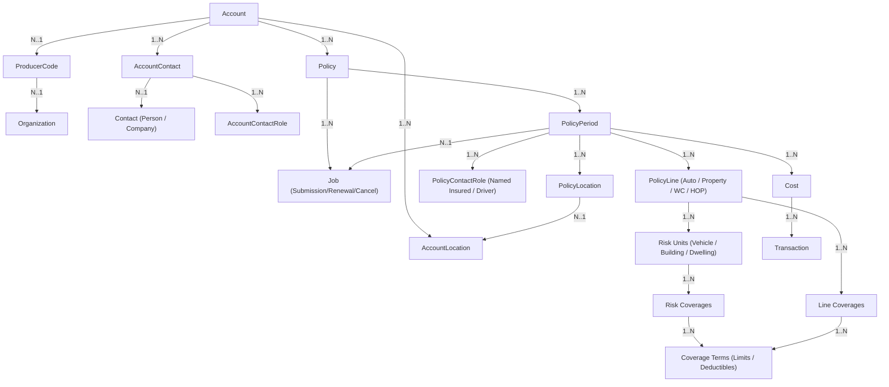
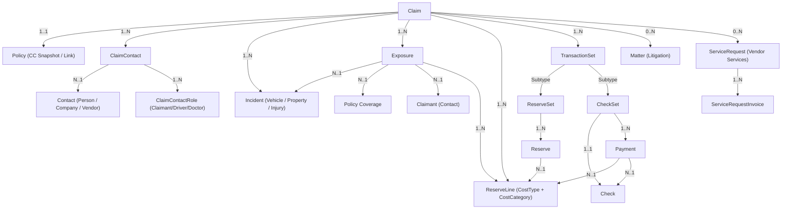

# Insurance Suite Entity Relationship Graph

**Guidewire Suite Version:** 10.2.1
**PolicyCenter Source:** `C:\GW10\PolicyCenter`
**ClaimCenter Source:** `C:\GW10\ClaimCenter`
**Extraction Date:** 2026-09-26

---

## 1. Overview & Verification Standard

This document provides the complete structural relationship graph for both Guidewire PolicyCenter and ClaimCenter, as well as the integration bridge between them. Every link, parent-child array, foreign key pointer, and cardinality is verified strictly from installed `.eti` metadata and Gosu data builders.

---

## 2. PolicyCenter Entity Hierarchy

```
Account (metadata/entity/Account.eti)
  +-- AccountContact (Account.AccountContacts array)
  |     \-- Contact / Person / Company (AccountContact.Contact FK)
  |           \-- AccountContactRole (AccountContact.Roles array)
  +-- AccountLocation (Account.AccountLocations array)
  +-- ProducerCodeOfService (Account.ProducerCodeOfService FK)
  |     \-- Organization (ProducerCode.Organization FK)
  \-- Policy (Policy.Account FK / Account.Policies array)
        +-- PolicyPeriod (Policy.Periods array / PolicyPeriod.Policy FK)
        |     +-- Job (PolicyPeriod.Job FK)
        |     |     +-- Submission / Issuance / PolicyChange
        |     |     \-- Renewal / Cancellation / Reinstatement
        |     +-- PolicyTerm (PolicyPeriod.PolicyTerm FK)
        |     +-- PolicyLocation (PolicyPeriod.PolicyLocations array)
        |     |     \-- AccountLocation (PolicyLocation.AccountLocation FK)
        |     +-- PolicyContactRole (PolicyPeriod.PolicyContactRoles array)
        |     |     +-- PolicyPriNamedInsured
        |     |     +-- PolicyAddlInsured
        |     |     \-- PolicyDriver
        |     +-- PolicyLine (PolicyPeriod.Lines array)
        |     |     +-- PersonalAutoLine
        |     |     |     +-- PersonalVehicle (PersonalAutoLine.Vehicles array)
        |     |     |     |     \-- PersonalVehicleCov (PersonalVehicle.Coverages array)
        |     |     |     +-- VehicleDriver (PersonalAutoLine.Drivers array)
        |     |     |     \-- PersonalAutoCov (PersonalAutoLine.PACoverages array)
        |     |     +-- CommercialPropertyLine
        |     |     |     \-- CPLocation -> CPBuilding -> CPBuildingCov
        |     |     +-- BusinessAutoLine
        |     |     |     \-- BusinessVehicle -> BusinessAutoCov
        |     |     +-- BusinessOwnersLine
        |     |     |     \-- BOPLocation -> BOPBuilding -> BOPBuildingCov
        |     |     \-- HOPLine
        |     |           \-- HOPDwelling -> HOPDwellingCov
        |     +-- Form (PolicyPeriod.Forms array)
        |     +-- Cost (PolicyPeriod.Costs array)
        |     |     \-- PACost / BACost / BOPCost / GLCost / HOPCost
        |     |           \-- Transaction (PATransaction / BATransaction)
        |     +-- PeriodAnswer (PolicyPeriod.PeriodAnswers array)
        |     \-- PaymentPlanSummary (PolicyPeriod.PaymentPlanSummary FK)
        +-- Activity (Policy.Activities array)
        +-- Note (Policy.Notes array)
        \-- Document (Policy.Documents array)
```

### PolicyCenter Mermaid Graph



---

## 3. ClaimCenter Entity Hierarchy

```
Claim (metadata/entity/Claim.eti)
  +-- Policy (Claim.Policy FK - Claim snapshot/link to PC policy)
  |     +-- PolicyCoverage (Policy.Coverages array)
  |     +-- PolicyLocation (Policy.PolicyLocations array)
  |     \-- Vehicle (Policy.Vehicles array)
  +-- ClaimContact (Claim.Contacts array)
  |     +-- Contact / Person / Company (ClaimContact.Contact FK)
  |     \-- ClaimContactRole (ClaimContact.Roles array: Insured, Claimant, Driver, Doctor, Attorney)
  +-- Incident (Claim.Incidents array)
  |     +-- VehicleIncident (Vehicle collision, speed, point of impact, driver)
  |     +-- FixedPropertyIncident (Building damage, property description, inspection)
  |     +-- InjuryIncident (Bodily injury, body parts, lost wages, medical treatments)
  |     +-- PropertyContentsIncident (Damaged personal property / equipment)
  |     \-- LivingExpensesIncident (Temporary housing, meal stipends)
  +-- Exposure (Claim.Exposures array)
  |     +-- PrimaryCoverage (Exposure.PrimaryCoverage FK -> Coverage)
  |     +-- CoverageSubType (TypeKey -> CoverageSubtype)
  |     +-- Incident (Exposure.Incident FK -> Incident)
  |     +-- Claimant (Exposure.Claimant FK -> Contact)
  |     \-- ReserveLine (Connects Exposure + CostType + CostCategory)
  +-- TransactionSet (Claim.TransactionSets array)
  |     +-- ReserveSet
  |     |     \-- Reserve (Reserve.ReserveLine FK, ReservingAmount, Status)
  |     +-- CheckSet
  |     |     +-- Check (Check.Claim FK, Payee, CheckNumber, PaymentMethod, GrossAmount)
  |     |     \-- Payment (Payment.Check FK, Payment.ReserveLine FK, PaymentType)
  |     \-- RecoverySet / RecoveryReserveSet
  |           \-- Recovery (Recovery.ReserveLine FK, RecoveryCategory)
  +-- Matter (Claim.Matters array - Litigation)
  |     \-- MatterExposure (Matter.Exposures array)
  +-- ServiceRequest (Claim.ServiceRequests array - Vendor management)
  |     +-- ServiceRequestInstruction
  |     +-- ServiceRequestQuote
  |     \-- ServiceRequestInvoice
  +-- Activity (Claim.Activities array)
  +-- Note (Claim.Notes array)
  \-- Document (Claim.Documents array)
```

### ClaimCenter Mermaid Graph



---

## 4. Cross-System PolicyCenter to ClaimCenter Integration Graph

```mermaid
graph LR
    subgraph PolicyCenter["PolicyCenter (SOR for Policy & Account)"]
        PC_ACCT["Account (AccountNumber)"]
        PC_POL["Policy (PolicyNumber)"]
        PC_PERIOD["PolicyPeriod (Term, Dates)"]
        PC_LINE["PolicyLine (LinePattern)"]
        PC_RISK["Risk Units (Vehicles/Locations)"]
        PC_COV["Coverages (Limits/Deductions)"]
        PC_ACCT --> PC_POL --> PC_PERIOD --> PC_LINE --> PC_RISK --> PC_COV
    end

    subgraph ClaimCenter["ClaimCenter (SOR for Claims & Financials)"]
        CC_CLAIM["Claim (ClaimNumber)"]
        CC_POL["CC Policy (Snapshot / Verified)"]
        CC_INC["Incident (Damage/Injury)"]
        CC_EXP["Exposure (CoverageSubtype)"]
        CC_FIN["Financials (Reserve, Payment, Check)"]
        CC_CLAIM --> CC_POL
        CC_CLAIM --> CC_INC
        CC_CLAIM --> CC_EXP --> CC_FIN
    end

    PC_POL -.->|Replicated / PolicyNumber Lookup| CC_POL
    PC_COV -.->|Coverage Matching| CC_EXP
    PC_RISK -.->|RU Mapping (VehicleRU / PropertyRU)| CC_INC
```
